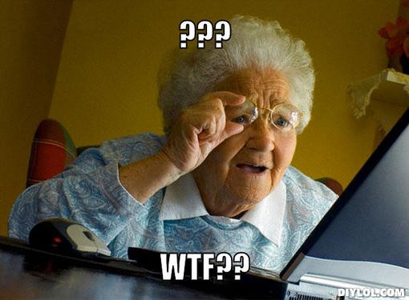

Fala pessoal, tudo certo? Meu nome é Raul, tenho 24 anos e sou desenvolvedor há quase 3 anos. Comecei a programar na faculdade com Java, PHP, até me deparar com o fascinante mundo do client-side e resolver abandonar um pouco o _server-side_ pra entender a mágica da força trindade HTML, CSS e Javascript.

Há pouco mais de uma semana eu me deparei com um problema que todo desenvolvedor já se deparou — e se ainda não, eu garanto que vai — que é encontrar um padrão textual em uma massa de dados. No caso, era pra fazer uma leitura de um código HTML inteiro e filtrar determinadas informações. Essa prática é chamada de [Web Scraping](https://en.wikipedia.org/wiki/Web_scraping).

Fazer isso manualmente apesar de trabalhoso, é fácil, afinal, é da natureza do ser humano buscar padrões em todo lugar. Mas e programaticamente? Bom, aí as coisas começam a ficar um tanto complicadas, afinal, são muitas variáveis como: “pode ou não vir uma classe”, “pode ou não ter id” e etc. É aí que a gente se depara com as tão temidas **Expressões Regulares**.

Voltando ao meu problema, tentei fazer de diversas formas (mesmo sem saber direito o que eu estava fazendo).

<gif src="https://miro.medium.com/max/1000/1*bSI3948DD5dxef6WMvV1UQ.gif" caption="Tentando montar uma regex sem saber nada de regex!"></gif>

Então eu decidi que eu iria estudar pra valer e aprender de uma vez por todas isso. E como é como dizem:

<big-quote>A melhor forma de aprender, é ensinando!</big-quote>

---

## Escopo

Vou dividir essa série de artigos da seguinte maneira:

<!-- TODO: Replace with the incoming blog url -->

1. Introdução (esse)
1. Metacharacters
1. Classes de caracteres
1. Quantifiers
1. Capturando Grupos
1. Âncoras
1. Regex no mundo JavaScript

Espero que vocês gostem da série e passem a utilizar no dia-a-dia de vocês sem precisar consultar no Stack Overflow! :p

---

## Mas afinal, o que é Expressão Regular?

Expressão Regular é uma linguagem de busca de padrões. Resumindo bem a opera, é uma linguagem onde dizemos o padrão (pattern) do texto que queremos encontrar, passamos o texto alvo (target) e pedimos para uma Regex engine (motor) fazer essa busca. É como se fosse o famoso `ctrl+f`, só que muito mais profundo e detalhado.


Como mencionado, para que seja possível realizar uma busca utilizando Regex, é necessário uma _Engine_, ou seja, um motor que tem a finalidade de avaliar o contexto e fazer a busca.

Cada linguagem de programação tem o seu motor e apesar de Regex ter um padrão fixo, há algumas diferenças e detalhes na implementação em cada uma. Mas o que vai mudar de fato é a forma com que se trabalha, e não a **lógica** e os **padrões** em si.

---

## Show me the example

Bom, vamos ver como funciona esse tal de Regex na prática pra ficar mais fácil.

Digamos que eu tenho um arquivo CSV com milhares de linhas com informações de pessoas, contendo na sequência: **Nome**; **Endereço**; **Cep** e **Telefone**.

```csv
João da Silva;Rua Cabloco terceiro, 25;11111-111;(99)9999-9999
Márcio Cunha;Rua João Gourlat, 150;12123111;(99)8888-9999
```

Então, queremos pegar apenas o CEP de todas as linhas de nosso arquivo. A forma mais fácil (não a mais otimizada) de fazer isso seria:

```txt
\d\d\d\d\d-\d\d\d
```



Calma jovem, muita calma. Vamos passo-a-passo:

O `\d` é uma classe de carácter (explicarei no próximo artigo), onde ele vale números de zero a nove (0–9). Logo, sabemos que todo CEP possui 5 números, um hífen (-) e mais 3 números. Logo, temos:

1. `\d\d\d\d\d` (5 primeiros números)
1. `-` (hífen da máscara do CEP)
1. `\d\d\d` (3 últimos números)


Porém, perceba que no exemplo, o cep do **Márcio** não possui máscara, e mesmo assim iremos considerar esse caso. Como podemos fazer isso?

No mundo da Regex, o ponto de interrogação tem vários super poderes e veremos todos eles durante a série. Mas, um deles é o papel de **quantifier**, ou seja, ele é um **atalho** (short hand) que diz que um elemento **pode ou não** aparecer na expressão.

Logo, para considerarmos o caso onde o hífen **pode ou não** vir, mudamos a nossa expressão para:

```txt
\d\d\d\d\d-?\d\d\d
```


Perceba que agora ambos os casos foram considerados.

## Conclusão

Como eu comentei anteriormente, esse é apenas um exemplo bem rústico e simples do uso de expressões regulares. Elas podem ficar muito mais elegante e fácil de ler e também muito mais complexas.

Caso queira testar você mesmo, pode utilizar o [Regex101](https://regex101.com/), um site que possui diferentes Regex Engine e até gera o código para a linguagem, dado o target e o pattern.

Até o próximo artigo! =D
