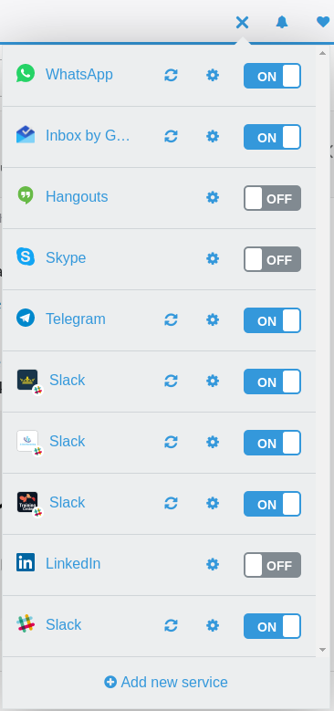
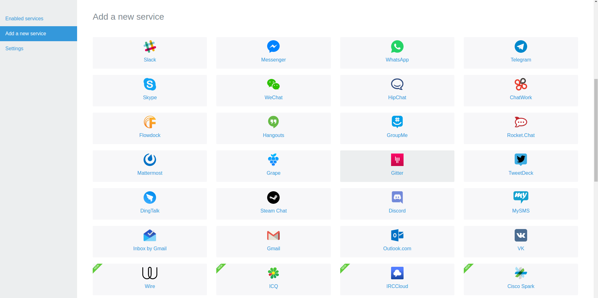
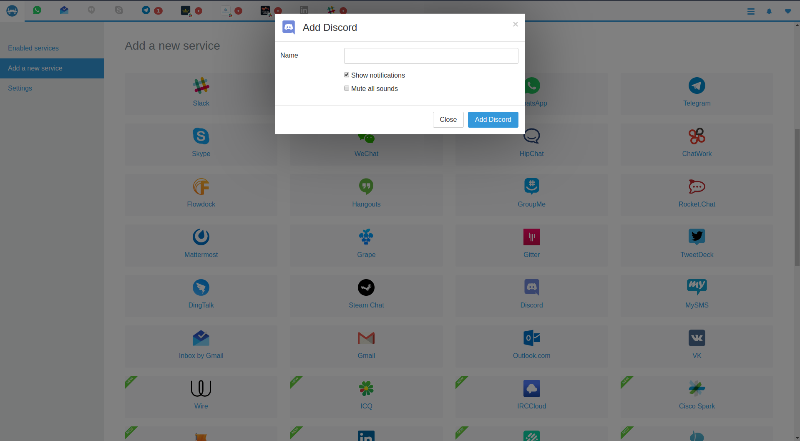
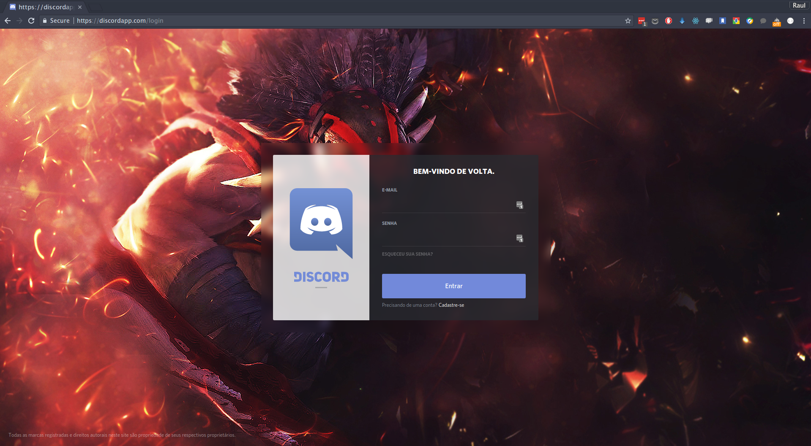

Fala Dev's, como estão? Hoje eu queria compartilhar com vocês umas das ferramentas mais maravilhosas que eu conheci há 2 anos atrás e sigo utilizando, que veio pra resolver um problema que provavelmente afete a maioria de nós: **excesso de meios de comunicação**.

---

## Franz, é de comer?

O Franz é uma ferramenta agregadora de mensageiros **totalmente gratuita\***. Nela é possível adicionar os mais famosos meios de comunicação em um só lugar e de forma bem organizada.

> UPDATE 2020: na época que escrevi esse artigo, a realidade era realmente essa, no price! Porém eles lançaram modalidades pagas nas quais oferecem mais funcionalidades por uma mensalidade.

## O Problema

A maior parte das pessoas normais utilizam o _WhatsApp_, _Messager_, _Hangouts_, _Email_, etc para se comunicar. Entretanto, nós desenvolvedores vamos um pouco mais além desses serviços mais comuns, por uma série de razões, e acabamos optando outras plataformas como os o _slack_, _telegram_, _discord_, _gitter_ dentre outros.

Provavelmente você faz parte de vários grupos no Slack. Grupos de estudo, de cursos, de podcast, de times de desenvolvimento (falando nisso, conhece o grupo no [Slack da CT](https://ctgroups.herokuapp.com)? Não? Vai lá conversar com a gente. Só pedir o convite clicando aqui), de frameworks e etc. É muito grupo!

Agora, imagina todos os dias abrir (quando lembra, né?) todos os meios de comunicação que você participa, cada um em uma aba do seu navegador favorito ou aplicativo desktop. Um saco, não?

## A solução

Dado essa problemática, um desenvolvedor Austríaco chamado [Stefan Malzner](https://twitter.com/smalzner), teve a ideia de usar as tecnologias de [multiplataforma](https://pt.wikipedia.org/wiki/Multiplataforma) em ascensão (a mesma que o [Atom](https://atom.io/) usa) de para construir o Franz, e assim, usar o desenvolvimento web como base e ainda conseguir atender os 3 sistemas operacionais principais (MacOS, Windows e Linux) e solucionar de uma vez por todas isso!

## Mas afinal, qual a mágica por trás?

<iframe src="https://giphy.com/embed/12NUbkX6p4xOO4" width="100%" height="100%" style="position:absolute" frameBorder="0" class="giphy-embed" allowFullScreen></iframe>

Como disse anteriormente, o Franz faz uso da mesma tecnologia que o Atom, onde você consegue desenvolver uma aplicação desktop utilizando as linguagens que compõe a web (HTML, CSS e JavaScript [até com frameworks JS]) e compilar para uma aplicação desktop 100% funcional. Atualmente há várias bibliotecas que conseguem fazer essa alquimia, mas a mais famosa é o [Electron](https://www.electronjs.org/).

Enquanto projeto em desenvolvimento, ele roda em cima do Chromium e do NodeJS. Após a compilação, ele consegue se transformar em uma aplicação nativa para cada sistema operacional, mas ainda rodando o Chromium, afinal, é ele que será utilizado para fazer a exibição de cada serviço.

---

## É seguro?

<iframe src="https://giphy.com/embed/ANbD1CCdA3iI8" width="100%" height="100%" style="position:absolute" frameBorder="0" class="giphy-embed" allowFullScreen></iframe>

Essa ferramenta se assemelha muito a um browser convencional. Basicamente, ela abre uma janela de navegador e chama pra você as API's web dos serviços, assim como https://web.whatsapp.com/ por exemplo.

Segundo a política de [privacidade do Franz](https://meetfranz.com/privacy), ele:

- **Não** guarda nenhum login e senha. As únicas informações usadas são os dados guardados nos [indexedDB](https://developer.mozilla.org/en-US/docs/Web/API/IndexedDB_API), [localStorage](https://developer.mozilla.org/en-US/docs/Web/API/Storage) e cache, os quais são gerados pelos próprios serviços;

- **Não** rastreia seu uso nos serviços. A única coisa que tem por trás é um google Analytics para colher estatísticas de uso do tipo, quais são os serviços mais acessados, etc.;

- Caso haja mudanças nas politicas de segurança, você será avisado no próprio aplicativo. Caso **você** não o desinstale após 21 dias de mudança, você automaticamente concorda com elas.

> UPDATE 2020: vale a pena checar novamente os termos de uso para ver se ainda são as mesmas regras. Com o passar do tempo empresas costumam altera-los para flexibilizar algumas práticas.

Logo, por mais que a teoria da conspiração sempre pode bater em nossas mentes, acho pouco provável que uma aplicação que vem ganhando mais e mais usuários e prestigio na comunidade tente agir de tanta má fé assim. Até porque, provavelmente se descobrirem algo, o nome dele como desenvolvedor é que ficará manchado.

Ainda sobre o reconhecimento da aplicação, a Product Hunt deu o prêmio a ele de melhor aplicativo destkop de 2016:

<blockquote class="twitter-tweet">
Congrats to <a href="https://twitter.com/smalzner?ref_src=twsrc%5Etfw">@smalzner</a>, maker of Franz, on winning Desktop App of the Year! All your messaging apps rolled into one. <a href="https://t.co/iFOatTCPWK">https://t.co/iFOatTCPWK</a> <a href="https://t.co/e6rlHmsXJt">pic.twitter.com/e6rlHmsXJt</a>
&mdash; Product Hunt (@ProductHunt) <a href="https://twitter.com/ProductHunt/status/811013236606767104?ref_src=twsrc%5Etfw">December 20, 2016</a></blockquote>

<iframe src="https://giphy.com/embed/TY7dLV4kDmZSU" width="100%" height="100%" style="position:absolute" frameBorder="0" class="giphy-embed" allowFullScreen></iframe>

---

## Novas soluções, velhos problemas

O Franz é realmente incrível e consegue resolver de forma exemplar o problema a que se propôs. Porém, como dito anteriormente, ele usa o Chromium como browser para exibição do conteúdo, e a base deste, é utilizada no Google Chrome.

Se tratando de Google Chrome, existe uma máxima que diz:

<big-quote>Não importa o quanto de memória que o seu computador possui, o chrome sempre vai tentar comer a maior parte dela.</big-quote>

### Pow, mas e aí?

Então jovem, se você tem um PC mais modesto, com 2GB de ram ou algo do tipo (ta na hora de trocar né? rs), talvez o Franz não seja uma opção tão boa assim.

Mas se você quiser usar mesmo assim, ele permite que você desabilite o serviço. Dessa maneira, é como se ele desligasse a página e todo seu carregamento, o que pode ajudar bastante nesses casos, deixando só o que você quer usar naquele momento **ON** e quando terminar, colocar como **OFF**.

---

> Raul, você me convenceu! Quero usar! Comofás?

<iframe src="https://giphy.com/embed/l46CyxkMBFwHlJ3kk" width="100%" height="100%" style="position:absolute" frameBorder="0" class="giphy-embed" allowFullScreen></iframe>

## Instalação

A instalação do Franz pode ser uma coisa um pouco chata caso você use Linux (normal no Linux, vai) e caso você **não** seja um hard user (assim como eu), existe uns tutoriais por ai que ensinam como fazer essa instalação.

Depois de ficar procurando algum que funcionasse certinho, finalmente eu consegui encontrar e salvei o conteúdo dele em um Gist (fazendo a referencia autoral). Se quiser dar um confere, basta acessar esse [link](https://gist.github.com/raulfdm/d43a2c2022446baf53238cc2fb17673b).

Caso você seja Windows, é só baixar o **.MSI** e next, next,next!

Caso você seja do MacOS, o arquivo de instalação é um .DMG. Pra ser sincero eu nunca usei um Mac na minha vida, então não sei como é a instalação desse tipo de arquivo no SO. Mas eu sei que você, mac user, sabe fazer isso numa boa! =P

---

## Instalei aqui. E agora?

Agora é só correr pro abraço! Abaixo vou listar algumas informações básicas, que provavelmente daria para você deduzir só de usar, afinal, a interface é bem amigável.

### Adicionando um serviço

Cada serviço tem suas características. Mas no geral, você seleciona que deseja instalar na tela principal:

Clica no serviço que você quer adicionar e um **popup** irá aparecer com algumas configurações relacionadas o serviço e ao atalho que será criado:

O nome é opcional, caso você não informe nada, apenas o ícone do serviço ficará na sua barra de navegação.

Você ainda pode escolher se quer que o Franz exiba as notificações ou que aquele serviço seja **mutado** (relaxa que da pra mudar isso depois).

### Logando

Como já sabemos, o Franz exibe páginas Web pra gente. Logo, ao adicionar o serviço, precisamos fazer o login normalmente, assim como se tivéssemos aberto nosso browser favorito e feito a mesma coisa:

Agora é só configurar teus serviços e ser feliz.

## Atalhos

Assim no browser, temos alguns atalhos que ajudam o nosso fluxo de uso. Abaixo uma lista dos que eu considero mais relevantes (obs.: Pra MacOS pode ser diferente, como sempre):

- Reload o program inteiro: `Ctrl + Shift + R`
- Reload só o serviço atual: `Ctrl + R`
- Zoom in: `Ctrl + =`
- Zoom out: `Ctrl + -`
- Zoom 100% (reset): `Ctrl + 0`
- Mudar de serviço (para direita): `Ctrl + Alt + ]`
- Mudar de serviço (para esquerda): `Ctrl + Alt + [`

No próprio programa junto com as funcionalidades no menu, tem descrito os atalhos. Sinta-se livre para usá-los ou não.

## Pontos de Atenção

Como eu comentei na parte de configuração, temos a opção de mudar todo o tipo de som de determinados serviços. Mas uma coisa que eu aprendi usando a ferramenta foi: quando você escolhe esta opção, é realmente todo e qualquer tipo de som.

Posso citar o exemplo do whatsapp. Caso você escolha mutar todos os sons, ao tentar escutar um audio que alguém ou assistir um video o audio estará mudo. Logo, caso você tente entrar em chat com alguém e não esteja ouvindo nada, vale dar uma olhada nessa configuração.

---

## Conclusão

Como pode ser visto neste artigo, o Franz talvez possa ser a solução mágica dos seus problemas com relação aos mensageiros. Mas ressalto o ponto de atenção na memória ram. Assim como é ruim abrir 100 abas do Chrome, deixar todos os serviços sempre ativos pode não ser uma boa opção!

Assim, se permita usar e testar durante alguns dias. Caso não goste ou não julgue necessário, apenas o desinstale! Mas tenho certeza que assim como eu, quando você instalar e começar a usar, vai querer levar ele para todo lugar!
