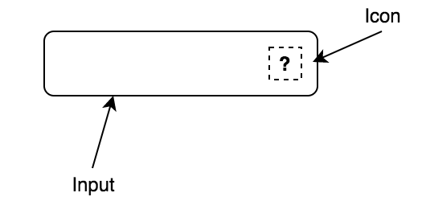
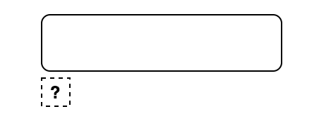
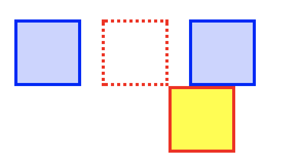

Fala galera, tudo certo? Hoje vim dividir com vocês um problema que eu estava tendo e acredito ser muito comum, principalmente com iniciantes sobre posicionamento de elementos e estilização.

Percebi que apesar de já ter usado n vezes, eu não entendia afundo as regras dessa regra e tive grandes problemas por não saber, ao tentar criar um component React que seria um input com ícone.

Mas calma, se você é iniciante e não sabe o que é React, nem esquente a cabeça. Neste artigo, e mostrarei o funcionamento do mesmo usando HTML e CSS puros.

---

## O problema

Como já mencionei acima, o problema que eu tive era de criar um componente de input que contivesse um ícone no canto. E já adiantando, eu percebi que há várias estratégias para implementa-lo, inclusive, utilizando pseudo elementos e etc.

Porém, por motivos de aplicabilidade no projeto atual e levando em consideração as futuras possibilidades que eu terei que cobrir, eu optei pela seguinte estratégia:

```html
<div class="input-icon">
  <input type="text" class="input" />
  <span class="icon"></span>
</div>
```

Mas, em ~React~ way.

O resultado teria que ser algo do tipo:



Mas, dado a estrutura e estilos dos elementos já de cada componente, meu resultado foi esse:



Para ilustrar melhor, vou simular o ambiente de forma bem simples e usar exemplos direto com Codepen:

<iframe height="400" style="width: 100%;" scrolling="no" title="raulfdm-position-absolute-1" src="https://codepen.io/yc_raulfdm/embed/MrRdXe?height=265&theme-id=dark&default-tab=result" frameborder="no" allowtransparency="true" allowfullscreen="true">
  See the Pen <a href='https://codepen.io/yc_raulfdm/pen/MrRdXe'>raulfdm-position-absolute-1</a> by Raul de Melo
  (<a href='https://codepen.io/yc_raulfdm'>@yc_raulfdm</a>) on <a href='https://codepen.io'>CodePen</a>.
</iframe>

---

## Position: Relative

Bom, assim como vários outros temas, eu tinha um conhecimento superficial de como era o funcionamento dessa propriedade.

Então arrisquei um um `relative`, afinal sabia que, após definido as coordenadas (top, bottom, left, right), ele se alinharia relativamente à sua posição:

<iframe height="400" style="width: 100%;" scrolling="no" title="raulfdm-position-absolute-2" src="https://codepen.io/yc_raulfdm/embed/aExrPL?height=380&theme-id=dark&default-tab=result" frameborder="no" allowtransparency="true" allowfullscreen="true">
  See the Pen <a href='https://codepen.io/yc_raulfdm/pen/aExrPL'>raulfdm-position-absolute-2</a> by Raul de Melo
  (<a href='https://codepen.io/yc_raulfdm'>@yc_raulfdm</a>) on <a href='https://codepen.io'>CodePen</a>.
</iframe>

Tinha dado certo parcialmente, era só fazer uns ajustes no `width`, mas… parecia meio estranho. Era como se o elemento estivesse ali, na mesma posição anterior, mas sua exibição fosse descolada.

Bom, é exatamente isso.

Fui correndo para o a documentação da propriedade position no [MDN Web Docs](https://developer.mozilla.org/en-US/docs/Web/CSS/position) e me deparei com esta imagem:



Minha suspeita estava certa, `relative` não me serviria.

---

## Position: Absolute

Bom, o fixed eu já sabia que não era, me sobrava o absolute. Tinha que ser ele. Corri no código e fiz a alteração:

<iframe height="400" style="width: 100%;magin-top:" scrolling="no" title="raulfdm-position-absolute-3" src="https://codepen.io/yc_raulfdm/embed/eyoaqW?height=265&theme-id=dark&default-tab=result" frameborder="no" allowtransparency="true" allowfullscreen="true">
  See the Pen <a href='https://codepen.io/yc_raulfdm/pen/eyoaqW'>raulfdm-position-absolute-3</a> by Raul de Melo
  (<a href='https://codepen.io/yc_raulfdm'>@yc_raulfdm</a>) on <a href='https://codepen.io'>CodePen</a>.
</iframe>

<big-quote>Que? Meu ícone foi parar lá na pqp… O que diabos estou fazendo de errado?</big-quote>

De volta a mesa das pesquisas, voltei no site da MDN e fui ler pra ver se entendia o comportamento do `absolute`:

> The element is removed from the normal document flow; no space is created for the element in the page layout. Instead, it is positioned relative to its closest positioned ancestor if any; otherwise, it is placed relative to the initial containing block.[...]

Na tradução livre…

> O elemento é removido da direção normal do documento. Nenhum espaço é criado para esse elemento no layout da página. Ao invés disso, o mesmo é posicionado relativo ao seu ancestral posicionado mais próximo, se houver. Caso contrário, será relativo ao bloco inicial.

E aí eu fiquei tipo:

<gif src="https://media.giphy.com/media/tu54GM19sqJOw/giphy.gif" caption="whaaat"></gif>

> Mas que merda é um elemento ancestral e pior, o que é um elemento ancestral posicionado?

Ainda na documentação, percebi que havia uma descrição sobre o que era um elemento posicionado:

> A positioned element is an element whose computed position value is either relative, absolute, fixed, or sticky. (In other words, it's anything except static.)

Na tradução livre…[2]:

> Um elemento posicionado é um elemento que possui um position definido por relative, absolute, fixed ou sticky. (Em outras palavras, qualquer posicionamento, exceto estático.

Ahhh… agora fazia mais sentido.

Elemento ancestral eu poderia deduzir que seria o pai, avô, bisavô, ou seja, elementos acima dele.

Juntando as informações e colocando em outras palavras:

O elemento com `position: absolute` vai ser relativo ao elemento ancestral (qualquer um acima dele hierarquicamente) que tiver definido um `position`, exceto para valor `static`. Caso não haja, ele será relativo no ao bloco inicial do documento (`html`).

<gif src="https://media.giphy.com/media/xT0xeJpnrWC4XWblEk/giphy.gif" caption="wooooaaahhh"></gif>

---

## A Técnica

Ainda lendo sobre o assunto, descobri no site do nosso mestre Yoda do CSS ([maujor](https://medium.com/@maujor_67380)), que existe uma técnica usada desde sempre para resolver o problema que eu estava tendo.

Essa técnica nada mais faz, do que respeita as regras que vimos no bloco anterior: Define um posicionamento para um elemento logo acima do que queremos.

Como já vimos na sessão do `relative`, ao definirmos tal posicionamento, nada acontecerá, e seja definido os valores das posições, o mesmo continuará ocupando o seu lugar no layout, apenas sendo exibido em outro lugar.

Assim, podemos aproveitar esse comportamento e definir para a nossa div `.input-icon`, um `position: fixed`, sem passar nenhuma posição.

Ao fazer isso, o ~elemento ancestral posicionado~ mais próximo do nosso `.icon` será o `.input-icon`, consequentemente, o ponto que será usado para posicionar relativamente o ícone:

<iframe height="265" style="width: 100%;" scrolling="no" title="raulfdm-position-absolute-4" src="https://codepen.io/yc_raulfdm/embed/eyoweV?height=265&theme-id=dark&default-tab=result" frameborder="no" allowtransparency="true" allowfullscreen="true">
  See the Pen <a href='https://codepen.io/yc_raulfdm/pen/eyoweV'>raulfdm-position-absolute-4</a> by Raul de Melo
  (<a href='https://codepen.io/yc_raulfdm'>@yc_raulfdm</a>) on <a href='https://codepen.io'>CodePen</a>.
</iframe>

---

## Ajustes finais

Agora, só resta alinhar o posicionamento do `.icon` para encaixar dentro do nosso input e definir um `padding-right` maior no `input`, para que o texto respeite o espaço do ícone:

<iframe height="265" style="width: 100%;" scrolling="no" title="raulfdm-position-absolute-5" src="https://codepen.io/yc_raulfdm/embed/opOrEO?height=265&theme-id=dark&default-tab=result" frameborder="no" allowtransparency="true" allowfullscreen="true">
  See the Pen <a href='https://codepen.io/yc_raulfdm/pen/opOrEO'>raulfdm-position-absolute-5</a> by Raul de Melo
  (<a href='https://codepen.io/yc_raulfdm'>@yc_raulfdm</a>) on <a href='https://codepen.io'>CodePen</a>.
</iframe>

---

## Update

Quando postei esse artigo no grupo FrontEnd Brasil no facebook, um rapaz chamado João Gabriel Hümmel fez o seguinte comentário:

> "Um detalhe interessantes é que vc alinhou as coisas básicamente no olho, existe a possibilidade de utilizar no icone, as propriedades top com 50% e transform com translateY(-50%). e ele sempre vai alinhar adequadamente no meio."

E foi interessante porque eu já tinha usado o `translate` algumas vezes, mas nem tinha me atentado que ele serviria muito bem para esse caso.

Fazendo uma leve alteração no código, temos o mesmo resultado, mas agora, independente do tamanho, ele sempre será alinhado no meio:

<iframe height="265" style="width: 100%;" scrolling="no" title="raulfdm-position-absolute-6" src="https://codepen.io/yc_raulfdm/embed/QQbbJg?height=265&theme-id=dark&default-tab=result" frameborder="no" allowtransparency="true" allowfullscreen="true">
  See the Pen <a href='https://codepen.io/yc_raulfdm/pen/QQbbJg'>raulfdm-position-absolute-6</a> by Raul de Melo
  (<a href='https://codepen.io/yc_raulfdm'>@yc_raulfdm</a>) on <a href='https://codepen.io'>CodePen</a>.
</iframe>

Achei deverás interessante e importante, muito obrigado pela colaboração! =D

---

## Conclusão

Quando estamos estudando algo, as vezes passamos batido por detalhes que podem fazer toda diferença sobre o entendimento e uso da ferramenta, linguagem, ou qualquer que seja a coisa que está aprendendo.

Após aplicar regra dos 80/20, onde 20% do conteúdo traz 80% de resultados, em outras palavras, aprender o funcionamento básico de algo para entender na visão geral como aquilo funciona, é válido as vezes parar para entender os outros 80%, ou seja, os detalhes mais profundos que causam apenas 20% dos resultados.

Espero que tenha ajudado você, que, assim como eu, já passou por vários problemas como esse!

Um abraço!
