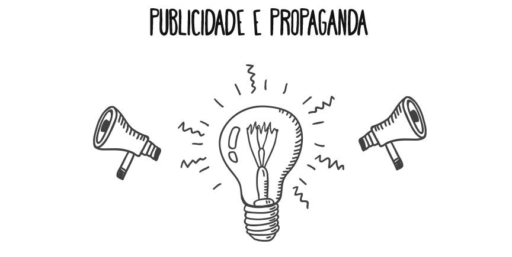

O ano era 2010. Comecei a trabalhar na farmácia do meu tio e apesar de compras online já existir há muito tempo, ainda não era como agora. Hoje, a preferência de boa parte dos usuários da internet é comprar produtos em lojas virtuais ou em sites de negócios.

Foi então que ele tomou uma decisão:

> E se eu vendesse os medicamentos da minha farmácia online? Compras pela internet parece algo promissor .

Como ele sabia que eu gostava de "ficar no PC", ele me contratou para ajuda-lo a (até então) tentar ser o pioneiro na minha cidade com essa abordagem.

Minha função era: Cadastrar os produtos no sistema, preenchendo a descrição e subindo uma foto do mesmo. Isso com TODOS os produtos da farmácia. Árdua tarefa.

Passei alguns meses alimentando esse banco de medicamentos, tirando foto e tratando no Photoshop as fotos e quando foi ao ar, durante 2 meses a loja online teve incríveis **5 vendas**, resultado esse que motivou meu tio a cancelar esse projeto.

<gif src="https://media.giphy.com/media/d41JlWDmJYyeA/giphy.gif" caption="#fail"></gif>

---

Sem cargo e desmotivado, ele me deu a oportunidade de trabalhar em sua distribuidora.

Lá, eu separava pedidos de clientes, organizava o estoque, fazia balanço e tudo que precisava ser feito, exceto comprar e vender.

Não era o tipo de trabalho que eu sentia tesão em fazer e a ideia de ter uma profissão que não fosse _auxiliar administrativo_ não me abandonava… Mas o que?

Foi então que, depois de muito refletir, me veio um curso na cabeça…

---

## Publicidade e Propaganda

Lendo sobre profissões, descobri a profissão publicitário.

Poxa, parecia interessante fazer essas propagandas na TV, no rádio, no outdoor. Além do mais, envolve a parte criativa, na qual apesar de não me achar o senhor criatividade, tenho um grande apreço.

> Por que não?

Lá fui eu, me matricular no bacharelado em **Comunicação Social: Publicidade e Propaganda**. Novamente eu tive o apoio da minha mãe, com a única condição que eu pegasse metade e ela metade! (mãe ❤)

### Início

Começo de semestre, trotes, festas, vida universitária parecia ser bem divertida. Afinal, eu ainda tinha o espírito jovem recém saído do colegial, porém, apesar de gostar de estudar algumas matérias específicas, ainda não gostava do que eu estudava.

Caso você não saiba, publicidade é uma faculdade da área de humanas, ou seja, você precisa LER muito.

Levei um choque de realidade quando um professor mandou a gente tirar xerox de um livro de 200 páginas, pois, o mesmo passaria um trabalho sobre aquilo.

> Como assim 200 páginas? Sabe quanto tempo eu levo pra ler 200 páginas? 1 ano pelo menos…

Mas, estava empolgado e tentando aprender o que era ser universitário… Vida que segue!

### Caindo na real

Tive matérias interessantíssimas no curso, como por exemplo, teoria da comunicação, filosofia, sociologia, introdução a publicidade e propaganda dentre outras.

E quando digo interessantes, digo que foram matérias que me ensinaram coisas pra vida, nas quais eu carrego comigo até os dias de hoje, como por exemplo:

- Q que é uma cultura de massa;
- Porque as disposições das prateleiras no mercado são como são;
- Como são formados nossos hábitos de consumo;
- Porque e como a TV e as mídias em geral influenciam nossa forma de pensar, hábitos de compra e etc.

Enfim, ensinamentos pra vida toda.

Entretanto, meu sentido aranha ainda me alertava que talvez eu não tivesse nascido pra ser publicitário.

Não me sentia envolvido ou conectado com a profissão. Tudo parecia muito interessante, mas era muita coisa pra ler e eu não tinha me apaixonado pelo curso.

Depois de 1 semestre, resolvi trancar a faculdade e repensar a respeito de tudo…

> Por que isso é tão difícil? O que será que eu nasci pra fazer? Já tenho 20 e ainda nem sei…

---

## Técnico em Segurança do Trabalho

Passado a decepção de ter abandonado o curso e retomando as pesquisas, me deparei com o curso de técnico em segurança do trabalho.

Caso você esteja no grupo das pessoas (maioria) que não sabe o que é, um **técnico em segurança do trabalho** é aquele cara na empresa que toma conta da segurança ocupacional dos trabalhadores. Em outras palavras, é o cara que faz (tenta) cumprir as leis de segurança trabalho, conhecidas como [Normas Regulamentadoras](https://enit.trabalho.gov.br/portal/index.php/seguranca-e-saude-no-trabalho/sst-menu/sst-normatizacao?view=default), tomando medidas que garantam que os colaboradores possam exercer sua profissão da maneira mais segura possível.

Parecia uma profissão nobre e com bom salário. E quando falamos em "bom salário", sempre precisamos entender o ponto referencial. Naquela época eu ganhava pouco mais de R$ 800 reais, e um salário médio de um técnico em segurança do trabalho era de R$ 2500,00~3000,00.

<gif src="https://media.giphy.com/media/VTxmwaCEwSlZm/giphy.gif" caption="make money"></gif>

Fui no Senac me matricular, comecei o curso no ano seguinte (2011) e continuei trabalhando com meu tio.

Depois de um ano inteiro no curso, senti a necessidade de fazer um estágio e ver como era a profissão de verdade. Além do mais, precisava aproveitar o gancho que eu havia saído da empresa do meu tio. Era a hora!

Depois de muita busca, finalmente consegui ser escrav… digo, estagiário para um consultor que era terceirizado de várias empresas.

Ganhando o incrível salário de R\$ 350,00 reais por mês, minha função era ficar em obras de uma construtora fazendo inspeções para ver se as pessoas estavam cumprindo as normas de segurança, usando equipamentos de proteção individual(EPI) e a parte mais legal, dar treinamento para os novos operários das empreiteiras na obra.

> Nota: Caso você não saiba, geralmente, uma empresa de construção não possui esse tipo de mão de obra própria. Logo, ela compra o terreno, faz o planejamento e contrata os empreiteiros. Cada empreiteiro tem (ou não) uma especialidade. Assim, o mesmo contrata pedreiros, pintores e etc. para trabalhar nessa obra. É o famoso emprego terceirizado.

A parte de dar treinamento ajudou muito a desenvolver minha oratória e didática, afinal, eu tinha que explicar da melhor forma possível para pessoas com baixíssimo nível de instrução e que, muitas vezes não sabiam escrever. Eu precisava ser entendido, independente do grau de instrução.

Apesar de gostar dessa parte do meu dia, ela era muito pequena. Comecei a perceber que era um trabalho muito ingrato e como o ser humano tem dificuldade pra entender o longo prazo ou coisas que pode acontecer no futuro.

Todos sabemos que ouvir música em um volume alto durante muitas horas, dias e anos, mais cedo ou mais tarde nossa audição será comprometida. Mas quem se importa com o amanhã, não é mesmo? Deixa eu fritar no meu [Sampley de Guitarra](https://www.youtube.com/watch?v=bisRe1YfEhY)!

Continuando, minha rotina de trabalho era ficar brigando com as pessoinhas pra elas usarem equipamentos de segurança e não morrerem, perder um dedo, um braço, uma perna, um olho.

Até que um dia, discutindo com um cara na obra, o qual estava trabalhando na sacada de um apartamento no 6º andar sem cinto, ouvi a seguinte frase:

<big-quote>"Parceiro, trabalho com isso há 20 anos, você nem tem 20 anos e quer vir falar como que eu devo fazer meu trabalho?"</big-quote>

Naquela hora eu fiquei tipo…

<gif src="https://media.giphy.com/media/CiYImHHBivpAs/giphy.gif" caption="Comé que é?"></gif>

Mas a vontade era…

<gif src="https://media.giphy.com/media/3o6fIVtcmll5axUU1i/giphy.gif" caption="Vou te descer a porrada seu maldito!"></gif>

Como uma pessoa podia pensar assim? No fim, minha vontade era deixar ele fazer aquilo e deixar ele morrer ou ficar paraplégico caso ele perdesse o equilíbrio na escada e caísse lá em baixo, mas em uma situação como essa, a responsabilidade é 100% da empreiteira e da obra.

Chamei o supervisor dele e o mesmo retirou o cara da obra.

Naquele dia, voltei pra casa refletindo sobre o que aconteceu e aquela sensação de _“não nasci pra ficar brigando com as pessoas pela segurança delas. Não quero ser responsabilizado pela morte de uma pessoa que simplesmente não quis seguir prezar pela própria vida.”_

Foi então que eu desisti do curso, mas naquela altura do campeonato, faltava apenas 6 meses pra terminar e eu resolvi concluir o curso e mandar aquela profissão pra merda.

Consegui um emprego de auxiliar administrativo em uma empresa de gestão documental e segui em frente, mas, DE NOVO… voltamos a estaca zero.

---

## Engenharia de Produção

Ainda no curso de Segurança do Trabalho, eu descobri que existia uma outra profissão chamada **Engenheiro de Segurança do Trabalho**.

Basicamente, é uma pós graduação pra quem cursou engenharia (qualquer uma), que te dava super poderes de assinar laudos e se responsabilizar pela autenticidade dos cálculos e coerência com as Normas Regulamentadoras (lá da galera do curso técnico).

Como técnico, eu poderia até saber fazer os laudos, contas, análises e inspeções, mas não podia assinar e me responsabilizar por ele. E no fim, era o que eu ouvia das pessoas que já trabalhavam com isso: “O engenheiro só assina os laudos que eu faço”.

Bom, parecia ser uma boa ideia, afinal, o investimento seria de alguns anos da minha vida estudando pra assinar laudos e ganhar 4~8x mais que um técnico.

Entretanto, qual engenharia? Eu precisava escolher qualquer uma para poder fazer essa pós graduação. Entre todas, a mais "fácil" me parecia a de produção.

Engenharia escolhida, mas ainda havia um porém: qualquer curso de engenharia é bem caro e minha mãe não poderia pagar pra mim e eu não ganhava dinheiro suficiente.

Foi então que recorri ao [FIES (Programa de Financiamento Estudantil)](http://sisfiesportal.mec.gov.br/) e depois de entregar a minha alma em formato de documentos, consegui o financiamento e iniciei a faculdade em Agosto de 2013, aos 21 anos.

### Início (de novo…)

Mais uma vez na faculdade, só que dessa vez um pouco mais velho e mais maduro. A cada ano que passa na vida você se sente mais maduro, mas caso você tenha uns 18 anos, daqui 4 anos você vai olhar pra você com 18 e vai dar risada de quão imaturo era.

Ao contrário dos meus companheiros de sala que tinham acabado de sair do colegial, eu já tava com o objetivo traçado e focado na minha salvação, digo, objetivo. Foi então que eu resolvi começar a estudar pra valer.

Mas como você pode imaginar, primeiro semestre de qualquer faculdade é uma grande merda, só tem matéria generalista. No caso da engenharia, tive Calculo I, Física, Álgebra Linear e etc., mas, surpreendentemente eu tive uma matéria que eu não esperava: **Laboratório de Programação I**.

Quando olhei minhas matérias do semestre, logo pensei:

> Mas que p\$\*ra é essa aqui 02?

Mas não liguei, afinal, FOCO NA MISSÃO!

### Laboratório de Programação

No primeiro dia dessa matéria, tive uma introdução do que seria a aula e o motivo de alunos de engenharia te-la e em seguida, uma demonstração de algoritmos.

Explicado o que era um algoritmo e sua base, fizemos um exercício para fixar o que havíamos aprendido: **criar um algoritmo para trocar uma lâmpada da sala de aula.**

E o que eu pensei foi:

> FÁCIL!

Passado 10 minutos, a professora começou a perguntar para cada aluno sobre o algoritmo desenvolvido e apontar os pontos falhos.

Chegou a minha vez. Acreditava que estava muito bom e completo.

> "Caralho, sou muito foda nesses algoritmos…"

Mas como eu **não sou especial** e nem o **novo Alan Turing**, estava cheio de falhas e processos não pensados.

Apesar de ter falhado na missão, aquele momento foi um dos raros momentos em minha vida que eu sentia uma extrema alegria em estar acontecendo.

Foi mais ou menos como essa palestra do Clóvis (Assista, sério).

<yt src="https://www.youtube.com/embed/rICKLns8p_M"><yt>

### Programação de Fato

Nos meses seguintes, fomos evoluindo a matéria e começamos a estudar programação com a linguagem [Portugol](https://pt.wikipedia.org/wiki/Portugol):

> “Portugol é uma pseudolinguagem que permite ao leitor desenvolver algoritmos estruturados em português de forma simples e intuitiva, independentemente de linguagem de programação. […]” — Wikipedia

Entreguei todos os trabalhos, fiz todos os desafios, eu estava fissurado em escrever linhas que instruíam o computador a realizar alguma ação.

<gif src="https://media.giphy.com/media/MM0Jrc8BHKx3y/giphy.gif" caption="Pode me chamar de Hackerman!"></gif>

Minha professora, que também fazia parte da coordenação do curso, notou o meu interesse acima do comum e "me fez a proposição":

> Ei Raul, eu percebo que você adora essa aula. Seu olho brilha quando você está fazendo as atividades. Quero convidar a você a mudar de curso e vir fazer sistemas de informação. Acredito que o curso seja feito pra você!

Fiquei atônito e sem saber o que pensar a respeito.

Naquele momento me veio na cabeça todos os sinais que eu já tinha tido no passado que, agora, pareciam tentar falar comigo e me mostrar a minha profissão.

Sem pensar duas vezes, disse: “Aceito!”.

Na minha última prova do semestre em Engenharia de Produção e fui direto na secretaria pra fazer a mudança para o curso de **Sistemas de Informação**.

Agora era pra valer! Agora tinha tesão! Agora vai!

---

## Agradecimentos

Antes de encerrar esse artigo, gostaria de agradecer a minha professora [Sandra Fantinato](https://www.linkedin.com/in/sandra-regina-costa-fantinato-820a4121/) que bancou a mestre Jedi e me mostrou "A Força".

Talvez se não fosse por isso eu teria demorado ainda mais pra descobrir "Qual é a minha praia".
