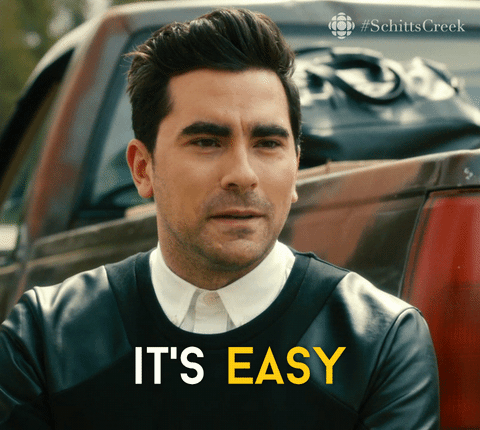

Continuando a (palestrinha) saga e já dentro do curso de **Sistemas de Informação**, consegui eliminar 3 matérias das 6 que eu havia feito em Engenharia de Produção.

Mas novamente, sofri com os mesmos problemas dos outros cursos: **o começo**.

Entrei no curso achando que no primeiro semestre ia aprender como hackear o Facebook, porém, o que eu aprendi foi noções de economia, _relacionamento interpessoal_, _cálculo II_ e outras matérias não muito interessantes.

Entretanto, foi nesse exato momento que eu comecei a enxergar a vida de uma outra forma…

---

## Mudanças

Se você leu os atos anteriores, você já sabe que na minha infância e adolescência eu era um jovem _mancebo_ pouco interessado por tudo que demandava "bunda na cadeira", exceto jogos.

Aos 19 anos, eu comecei a tomar gosto por leitura e esse perfil que era tão presente em mim começou a mudar e eu comecei a enxergar que estudar não era (ou não deveria ser) um tédio total. Porém, foi no curso de sistemas que eu tive que "mudar ou arregar".

Lembro que ainda no primeiro semestre do curso eu tive uma aula de Sistemas Operacionais com o professor chamado Luciano Albuquerque, um dos melhores professores da minha faculdade. E foi nessa disciplina, com esse professor, nessa disciplina especifica que eu cheguei a seguinte conclusão:

> Eita p*\*\*…. Agora f*deo tudo…

---

## Choque de dificuldade

Entrei na faculdade achando que os professores eram obrigados a me darem as coisas o mais mastigado possível, pra eu só fazer a digestão.

E não que não deva ser assim, mas quebrar a cabeça com algo difícil e falhar miseravelmente faz parte do processo cognitivo, ou você não reparou ainda que você só aprende quando você **tenta, erra, tenta de novo e consegue?**

Quando comecei a disciplina de Sistemas Operacionais (SO), o único SO que eu conhecia e sabia usar era o Windows e ainda totalmente light user.

Logo no primeiro dia de aula fomos para o laboratório. Já cheguei ligando o PC no Windowszinho, até ouvir uma voz falando:

> Galera, na hora do Boot, seleciona a opção Linux Fedora.

Quando ouvi isso, fiquei meio:

> Q? Linux? que merda é essa minha gente? Cadê minha interface? Terminal? Ah não mano…

Bateu o desespero. O professor partindo do principio que todo mundo já sabia traquejar um terminal, eu, novato, com vergonha de falar que não sabia NADA daquilo.


Enfim, fiquei sem saber o que estava acontecendo durante boas semanas, mas tudo bem, estava começando a pegar aos poucos.

---

## A Proposta

Ainda no primeiro mês do semestre, o professor fez a seguinte proposta:

> Galera, seguinte, não sou fã de provas, logo, vou dar uma alternativa pra vocês. Ao invés da prova bimestral e final, vocês me apresentam um trabalho e ele contará como nota total.
> Porém, a exigência com a qualidade e a complexidade do trabalho vai ser bem alta.
> E aí, vamo fecha?

Como você deve imaginar, não pensamos duas vezes: **trabalho**, claro. E todos sabemos como fazer um bom trabalho, não é mesmo? ( ͡° ͜ʖ ͡°)


O foco do trabalho era falar tudo sobre um sistema operacional específico, desde a sua **estrutura**, **gerenciamento de memória**, a **arquitetura**, enfim, as características que fazia ele se diferenciar dos outros.

Eu, na minha inocência logo pensei:



---

## O Trabalho e o desespero

Como bom aluno, fui procrastinando o máximo que eu consegui. Até que algumas semanas da data da entrega, peguei um livro na biblioteca pra checar se ia ser tranquilo de fazer.

A cada página que folheava do livro, aumentava o desespero dentro de mim. Eu não fazia a MENOR IDEIA do que eram aqueles termos, do que era aquilo tudo.

A sensação que eu tinha era:

> Pera, eu deveria ter tido uma aula antes dessa né? Não pode ser. Ninguém me explicou isso aqui… e isso aqui também não…

Enfim, peguei o livro. E aí você pode se perguntar:

> Mas e aquele papo de Google + Wikipedia?

Então, naquela época eu tinha bastante dificuldade em estudar coisas em inglês, e os assuntos eram muito específicos, com pouco ou nada traduzido para o português. O livro era a melhor opção.

Quando comecei a ler o bendito, fiquei meio aterrorizado. Foi uma das leituras mais difíceis que eu havia feito até então, dado a minha ignorância sobre boa parte dos termos.

A dinâmica da leitura era mais ou menos assim:

```txt
[...] A estrutura do Windows XP é ilustrada na figura abaixo, onde a HAL interage diretamente com o hardware, fazendo comunicação entre ele e o resto do sistema.[...]
```

> Pera, que que é HAL?

```txt
"[...]Hardware Abstraction Layer ou Hardware Annotation Library (HAL), em português Camada de Abstração de Hardware ou Biblioteca de Anotação de Hardware, é um subsistema de software para sistemas operacionais do tipo UNIX que fornece abstração de hardware. [...]"
```

> Ta, mas o que que é UNIX mesmo?

```txt
"Unix é um sistema operativo portável, multitarefa e multiutilizador originalmente criado por Ken Thompson, Dennis Ritchie, entre outros, que trabalhavam nos Laboratórios Bell da AT&T. [...]"
```

Beleza, mas o que seria um Sistema operacional multiutilizador?

```txt
"[...]Uma característica importante do Unix é ser multiusuário (multiutilizador). Bovet e Cesati [4] definem um sistema multiusuário como "aquele capaz de executar, concorrente e independentemente, várias aplicações pertencentes a dois ou mais usuários".[...]"
```

E assim por diante.

Eu nunca havia passado por uma experiência daquela e a primeira etapa foi a negação:

> Tá errado isso, não é possível. Não é justo fazer um trabalho assim. Mimimi

E apesar de ter ficado muito irritado de fazer um trabalho assim, hoje eu entendi que geralmente os aprendizados tendem a ser dessa maneira. Imagina que seu chefe chega e fala:

> Precisamos implementar Testes automatizados no desenvolvimento dos nossos projetos

Pode ser que você atualmente conheça ZERO sobre testes. Então começa a ler sobre e se deparada com alguns termos como por exemplo, **mock**, **teste de caixa branca**, **teste de caixa preta**, **teste unitário**, **teste de aceitação**, enfim, você vai se deparar com vários termos que não conhece e vai precisar ler sobre eles.

Voltando à história, no dia da apresentação do trabalho eu ainda não me sentia confiante para a apresentação. Eu passei muito tempo me lamentando de como a vida estava sendo dura e pouco tempo me preparando e aceitando o fato de que o precisa ser feito, precisa ser feito.

Não lembro quanto foi minha nota, mas acho que não foi alta. Porém, naquele ponto nota em si já não importava, pois a maior lição havia sido aprendida e o despertar da força havia acontecido.

---

## Raul ❤ Web

No terceiro semestre tive uma matéria chamada **Tecnologias de Comércios Eletrônicos**. O foco era demonstrar como era possível fazer um sistema comercial na web.

Até então eu estava aprendendo a programar com C e C++, mas foi nessa aula fui introduzido ao famigerado PHPzinho, a famosa linguagem dos sobrinhos e da gambiarra! hahaha (brinks galera do PHP).

Tive noções básicas da linguagem, estruturas de dados, laços de repetições, etc.. Uma introdução sobre HTML e CSS era isso ai!

Quando começamos o Hands-on foi foda demais! Usamos o [XAMPP](https://www.apachefriends.org/pt_br/index.html) pra ter a estrutura completa necessária (PHP + MYSQL + Servidor) e começar o desenvolvimento.

Basicamente, o objetivo era fazer um CRUD (_Create_, _Read_, _Update_, _Delete_) simulando um sistema web funcional.

E nessa época eu já comecei a ver que o meu perfil de aprendizado (no qual eu vou falar sobre em um Ato específico) era mais de estudar em casa e sozinho do que na sala de aula, pois, em uma sala de aula, o professor sempre precisa regular a velocidade do conteúdo, dependendo de como anda o rendimento da sala de aula, e modéstia a parte, eu sempre fui muito acelerado com esse tipo de aprendizado. Até desenvolvi a incrível habilidade de assistir video aula aumentando a velocidade do video de 1x pra 2.5x ou 3x e ainda aprender.

O desenvolvimento tava bem interessante, mas eu não sabia estilizar meus componentes e tinha pouca ou nenhuma noção de design. Eu só conseguia pensar:

> Será que não existe nenhum estilo pronto? Não tempo tempo pra fazer o meu próprio.

Foi aí que eu conheci o [Bootstrap](https://getbootstrap.com/).

Hoje eu dou muita risada dessa época. Lembro de ler a documentação pra saber como eu usava aquilo no meu projeto e eu via algo do tipo:

> Insira a classe .col-md-6 para aplicar 6 colunas no layout do seu elemento

E no meu HTML eu ia lá e colocava:

```html
<div class=".col-md-6">
  ...
</div>
```

E como você já deve estar imaginando, não funcionava, afinal, o ponto (`.`) é uma representação de que aquilo é o nome de uma classe. Eu não tinha estudado a base do CSS pra entender isso.

Meses se passaram, entreguei o projeto funcionando e aquela sensação de: Eu realimente gostei disso, permaneceu.

E foi aos 22 anos de idade que eu decidir que eu queria MUITO aprender esses negócios de web, mas, ainda estava meio obscuro por onde começar.

---

## A descoberta da comunidade

Já 2015, dois semestres após esse evento e depois de aprender a programar em Java, Android, sobre estruturas de dados, estatística e várias outras matérias muito interessantes, eu tive uma matéria chamada **Engenharia de Software**.

Até então, nem sabia que existia engenharia pra escrever um programa, mas essa foi outra matéria que abriu minha cabeça e me levou de encontro com uma das coisas mais valiosas da nossa área: **A comunidade**.


Pra melhorar as coisas, a matéria foi dada pelo Luciano, o mesmo professor de Sistemas Operacionais.

No decorrer do semestre aprendemos metodologia de desenvolvimento de software (cascata, agile, scrum) e sobre organização de projetos. E advinhem só? A mesma proposta do trabalho foi feita.

Obviamente, todo mundo aceitou, e nessa época eu já estava no 5o semestre da faculdade e treinado nos desafios.

Meu trabalho era sobre controle de versão usando Git e Github, e como você já deve imaginar, eu não fazia a menor ideia do que era Git e Github. Inclusive, me perguntava sempre se era a mesma coisa.

Foi então que cai no maravilhoso video da [Loiane Groner](https://twitter.com/loiane?lang=en): [Git e Github para iniciantes](https://www.youtube.com/watch?v=UMhskLXJuq4).

Assisti o video inteiro e fiquei maravilhado com tudo aquilo. Eu não comentei, mas naquela época eu tinha conseguido um trabalho como suporte técnico e na empresa eles faziam versionamento dos projetos com o SVN. E sério, pensar em Git foi uma coisa sensacional e disruptiva.

Depois de fazer o trabalho, apresentar, percebi que eu precisava começar a subir meus códigos todos no Github. Afinal, agora eu já sabia o que era, tinha entendido a importância de ter uma conta, queria fazer parte dessa rede.

E foi então que eu continuei pesquisando e descobri que havia uma comunidade gigante dentro da plataforma. Vários projetos open-source interessantíssimos, pessoas do mundo inteiro.

Decidi então publicar todo código que eu fizesse, entrar em todos os grupos no Facebook sobre desenvolvimento das tecnologias que me interessassem. Em outras palavras, eu havia entendido uma lição muito simples e muito importante:

<big-quote>"Se eu quiser fazer isso pra valer, eu preciso respirar isso. Eu preciso entrar nessa comunidade, conhecer as pessoas, ajudar onde eu for capaz de ajudar. Eu preciso mirar minha vida nessa direção."</big-quote>

E foi isso que eu fiz! Comecei a consumir o que a comunidade provia, incentivar, interagir com tudo que eu pudesse.

E hoje cá estou, tentando devolver a ela.

---

## Mas afinal, faculdade vale a pena?

Essa é uma das perguntas mais polemicas que giram em torno das pessoas da área de TI. E o pior que ambos os lados são sensatos nas respostas.

Eu me considero uma pessoa razoável, ou seja, eu não gosto de lados, 8 ou 80, direita ou esquerda, sim ou não. O mundo é muito mais CINZA do que preto e branco.

Eu gosto de entender os "porquês" de todos os lados e pensar de forma mais razoável sobre qualquer assunto, e com esse esse tema não seria diferente.

Abaixo, uma lista de **pros** e **contras** (explicando cada um) sobre fazer faculdade na minha opinião:

### Pros

<!-- TODO: Fix this distance -->

#### Ter um diploma

Parece muito besta você ter um papel, né? Mas então, esse papel pode te garantir algumas coisas interessantes, como por exemplo, ter a possibilidade de ir para outro país sem empresas te patrocinando. Em muitos países é exigido 10 anos de experiência na profissão comprovada OU uma simples graduação. Em outras palavras, `10 anos de Exp. === 4 anos de faculdade`.

Além do mais, apesar da nossa área ser muito mais tranquila com relação a isso, existem empresas, principalmente as mais tradicionais e de grande porte que exigem uma graduação, seja pra você entrar ou pra subir de cargo. Assim, pelo sim ou pelo não, você acaba aumentando seu leque de oportunidades.

#### Experiência Universitária

A experiência universitária é algo bem interessante em diversos aspectos. Ela meio que te prepara pra muitas coisas. Como eu contei anteriormente nesse texto, eu fui forçado a mudar minha forma de pensar para conseguir progredir na faculdade. Progressão essa que mudou a forma com que eu enxergo a vida e os estudos como um todo.

Quer queira ou quer não, é um lugar que você tem contato com várias pessoas diferentes, cada um com a sua maneira de pensar. Você está aberto a discussões, a errar sem medo, a questionar todo mundo. É o momento que você pode extrair o máximo de todo mundo e isso é realmente legal.

#### Insigths

Outro ponto interessante da faculdade é que você tem contato com muitas matérias diferentes. Por exemplo, tive matérias de gestão de processos, administração, liderança, banco de dados, Java, C#, Android, redes, estruturas de dados, estatística e de muitas outras áreas diferentes.

Assim como eu descobri que eu queria trabalhar com Web em uma matéria e ter descoberto que eu gosto de estatística, tive colegas de sala que descobriram que queriam trabalhar com C#. Outros que odiavam programar e foram para parte de infra.

Então caso você ainda não saiba o que quer fazer na área, ter esses breves contatos pode te ajudar e muito.

#### Networking

Essa questão vai depender de muitos fatores, mas no geral, você faz contato com muitas pessoas que podem te abrir portas. Colegas de sala, professores, pessoas de outros cursos, enfim, desde que você conheça pessoas e mostre a elas o seu valor, pode ser uma coisa muito interessante.

E mostrar esse valor é muito importante. Digo isso porque de todas as pessoas que eu estudei junto, consigo contar nos dedos de uma mão os que eu indicaria pra trabalhar em algum lugar, afinal, só vale você arriscar uma indicação se a pessoa for boa, não é? Se ela der mancada ou for ruim, você fica queimado.

Além do mais, sempre tentei dar o meu melhor e muitos professores viram isso! Tanto isso é verdade e me ajudou que antes de vir pra Europa um professor me mandou mensagem no LinkedIN com uma proposta de trabalho.

### Contras

#### Preço

Acho que você já pode imaginar que fazer uma graduação não é algo barato. A faculdade que eu fiz tinha uma mensalidade absurda de quase R\$ 1000,00 por mês. E apesar de ter conseguido financiamento do governo (FIES), eu preciso pagar isso né?

Óbvio, há universidades bem mais baratas, mas não deixa de ser um investimento de 4 anos para algo que na nossa área não é fundamental.

#### Tecnologias Antigas

Não sei se você está antenado no mercado, mas, a área de tecnologia é uma coisa assustadora. As demandas mudam muito rápido, porque as tecnologias mudam muito rápido, e infelizmente, faculdades não conseguem acompanhar tal mudança.

Levando em consideração um curso de 4 anos, a grande precisa ser estabelecida ANTES, certo? Pensa 4 anos atrás as tecnologias do momento. Imagina se no curso eles colocassem AngularJS (v1.x). Os novos alunos do curso estariam aprendendo uma tecnologia quase morta já (apesar de ter uma demandinha por esses profissionais).

E mudar não é tão simples assim, pois, envolve burocracias com o MEC (Ministério da Educação), burocracias na própria universidade, enfim, quando estamos falando de uma graduação, mudar não é de uma hora pra outra. Logo, eles tentam ensinar tecnologias consolidadas e muitas das vezes o mercado pede por outras coisas.

Não aprendi NADA de JavaScript na faculdade e hoje a demanda por profissionais que dominam essa linguagem é altíssima, tanto na parte de Front (Vanilla, React, Angular, Vue, Ember) quanto na parte de back-end (NodeJS). Ou seja, tudo que eu uso no trabalho de tecnologia, não aprendi quase nada na faculdade.

#### Peso do diploma

Aqui o choro come solto. As pessoas tem uma falsa sensação de que um pedaço de papel as concede super poderes e muito conhecimento, e isso acontece em TODAS as áreas. Elas acreditam que alguém que estudou por conta, na internet, livros, cursos paralelos, NUNCA vai poder saber mais que elas, afinal, elas passaram 4 ou 5 anos indo todo dia para aula e "estudando".

Mas calma lá né? Isso é o maior bullshit que eu já ouvi na vida e inclusive vi acontecer.

Lembro certa vez em uma empresa que trabalhei, foi contratado um professor universitário com vários diplomas, mestrado, pós graduação e especializações com a ilusão de que ele fosse um poço de sabedoria e conhecimento. Entretanto, na prática, ele ficava (e ouso dizer que ainda fica) muito abaixo do nível técnico dos outros desenvolvedores.

E a resposta do motivo disso é muito simples, nossa área (e outras também) o conhecimento não está ligado com formação acadêmica. O youtube, cursos de assuntos específicos, artigos e própria mão na massa ensinam mais do que aquelas 4 horas por dia indo pra faculdade.

E sabendo disso, muitas, mas MUITAS empresas nem pedem diploma. É tipo, você sabe? **SIM!** Então me prova. Se você mostra que sabe, não interessa de onde veio esse conhecimento, o que interessa é que você o possui e ponto final.

---

## Concluindo

Fazer uma faculdade pode ser muito interessante em diversos aspectos. Se você tiver tempo, dinheiro ou em algum momento o seu objetivo te exige isso, vá e faça.

Mas diferente de medicina por exemplo, onde você não consegue assistir Greys Anatomy, ler livros e se declarar um médico, na área de TI você pode SIM ser um excelente profissional sem ter pisado em uma faculdade, somente com estudos por conta.

Antes de qualquer coisa, pense no seu objetivo futuro, pense na sua condição e avalie se é uma boa opção ou não.

Só para finalizar, eu tranquei a faculdade no ultimo semestre pra tentar a vida na Europa e não pretendo voltar para concluir, afinal, não está fazendo falta alguma.

A única vez que fez falta foi uma vez onde recebi uma proposta pra trabalhar em um projeto para um **órgão do governo brasileiro** como dev front-end. Feito a entrevista técnica, o entrevistador me disse: Essa vaga é tua. E era mesmo, se não fosse o fato de que o governo exigia que TODOS os membros da equipe fossem graduados.

Em contra partida eu fui contratado pra trabalhar na Holanda e o pessoal aqui nem perguntou se eu tinha ou não um curso superior.

<gif src="https://media.giphy.com/media/d3mlE7uhX8KFgEmY/giphy.gif" caption="#reflitam"></gif>
