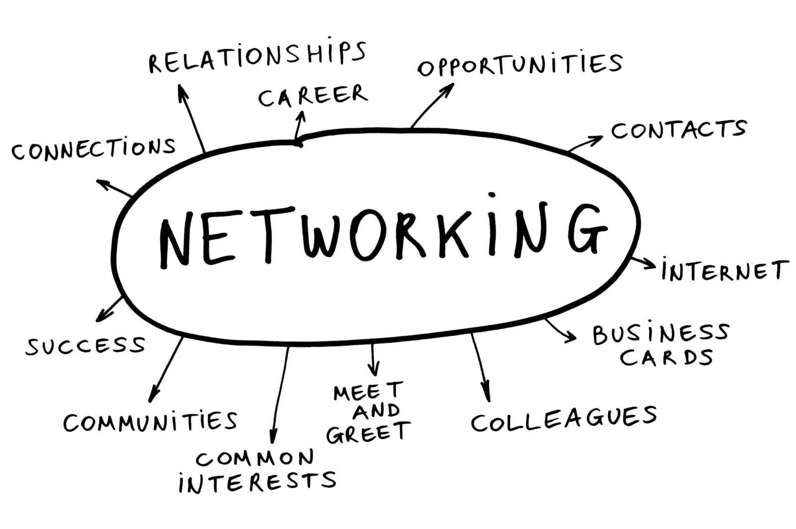
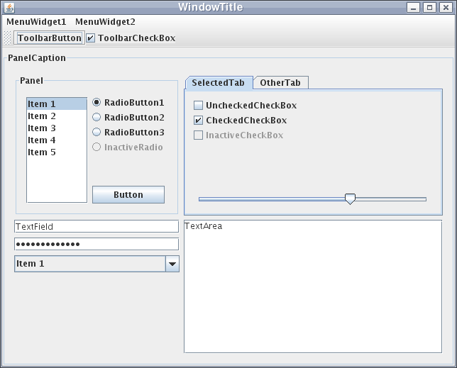

Nos atos passados, comentei um pouco sobre minhas experiências profissionais até então. Ainda tem muitas outras que não comentei mas que me trouxeram uma bagagem do que é trabalhar, e quando eu digo isso, digo sobre o que é trabalhar em cargos de nível hierárquico na base da pirâmide.

Entre os 18 e 21 trabalhei como auxiliar administrativo em pelo menos umas 7 empresas e, em cada uma delas, eu tinha uma responsabilidade diferente. Trabalhei de entregador (motoboy), fazia freelas de garçom, bartender de festa de mais de 10 mil pessoas, de casamento, shows, festas “classe A/B/C”, trabalhei em uma transportadora fazendo carga e descarga. Enfim, em 3 anos fiz muita coisa diferente.

E antes de entrar pra TI, trabalhei em uma empresa de gestão documental, e apesar de ser estranho, é onde se inicia minha história com TI, não de forma direta, mas indireta.

Nos trechos a seguir você vai entender como o relacionamento interpessoal e tentar ser uma pessoa agradável, responsável e querida (não por todo mundo, claro), me ajudou a mudar os trilhos da minha vida.

---

## Gerenciando Documentos

Quando fui convidado pra fazer entrevista nessa empresa, eu não fazia a menor ideia do que se tratava. Pensando bem, pouco importava, eu precisava de um emprego e nada mais.

Somente após ser contratado foi que eu entendi qual era o core business da empresa. Basicamente se tratava de uma empresa que realizava gestão, armazenamento e controle de documentos físicos para outras empresas que não possuiam espaço físico para o armazenamento dos mesmos, ou, em outras palavras: _“Me paga uma mensalidade que eu guardo esses documentos pra você. Se tu precisar, só manda qual documento que é que eu te devolvo”_

Parecia um negócio bem promissor, e realmente é, quando há uma gestão eficaz.

Enfim, comecei no trabalho e fui destinado a tocar um setor que ninguém que já trabalhava lá queria: **o recebimento dos documentos**. E o motivo para essa aversão? É que como nunca ninguém tocou o setor corretamente, estava uma completa bagunça e necessitava de organização de acordo.

Bem, sempre gostei de organizar as coisas, fazia isso com meu quarto, meu computador, meus materiais de estudos, por que não fazer aqui?

---

## Mindset e os desafios

Desde pequeno, minha mãe sempre me disse uma coisa, que eu levei e levo pra mim como hino:

<big-quote>“Filho, sempre dê o melhor de si, mesmo quando não for o que você exatamente o que almejava, pois, isso pode abrir portas que você nem imagina”. — Mãe</big-quote>

Eu já tinha testado essa teoria na prática por diversas vezes e sabia que funcionava, dessa vez não seria diferente.

Algumas semanas depois (ou meses), consegui finalizar a organização do setor e estabelecer um fluxo lógico de recebimento de cada documento recebido. Os gestores e a diretoria estavam contentes com o valor que eu havia entregado!

Tempos depois, fui escolhido pela coordenadora para tocar um projeto que vinha se arrastando por muito tempo, a organização dos documentos de um cliente que já havia pago para uma limpeza e catalogação geral de uns documentos bem antigos.

Aquele ambiente, trabalhar lá, estava me deixando entediado. Eu sentia a necessidade de ser desafiado, e aquele tipo de trabalho não conseguia me desafiar. Vi na proposta da coordenadora uma chance de fazer algo grande, ou pelo menos, algo que me desse uma dorzinha de cabeça. Aceitei.

Quando me deparei com o projeto em si, percebi o que esperavam de mim. Além de estabelecer processos para fazer aquilo acontecer pra valer, eu teria que liderar uma equipe de 4 pessoas. Liderar, sempre me pareceu tão difícil.

Ser gestor, por mais que seja de uma equipe bem pequena como era o caso, envolve muito relacionamento interpessoal, maturidade pra lidar com os problemas, saber ouvir, praticar empatia, enfim, envolve um skillset bem diferente e muito voltado pro lado humano.Mas, não podia voltar atrás.

No primeiro dia lá, sentei com o pessoal do projeto para tentar entender o que estava sendo feito, o que já havia sido feito, quais as sugestões de melhoria de cada um, para daí então, bolar um plano de ação.

Plano de ação elaborado, era hora de botar em prática e ver o resultado (_#failfast_).

Foram alguns meses trabalhando duro nisso, fazendo ajustes no plano quando necessário e trabalhando demais. Ao contrário do que você pode pensar, eu fui escolhido pra ser gestor, mas eu assumi boa parte do trabalho braçal também.

Enquanto as pessoas ficavam fazendo a limpeza e catalogação dos documentos, eu e uma outra pessoa, descia os documentos das prateleiras, e as vezes eram caixas de 20kg, formávamos uma pilha de caixas em cima de uma paleteira e levávamos para eles. Quando as caixas estavam certas e organizadas, eu me encarregava de guarda-las de volta também.

Trabalho braçal demais, pesado, voltava pra casa encardido de poeira das caixas. O pensamento de desistir daquela merda toda e mandar se foder era grande, mas, eu tinha um compromisso comigo mesmo, não podia desistir.

Apesar de todo esse esforço fisico, aparte mais difícil com certeza foi liderar as pessoas. Nós, seres humanos, somos muito complexos e cheios de problemas internos e externos. Quando não estamos tentando resolver um já existente, criamos outro, e o ciclo se repete até o fim da vida.

Apesar de muitas vezes não ter resolvido da melhor forma, tive muitos feedbacks positivos sobre o trabalho que eu vinha fazendo no setor, tanto dos gestores quanto da minha equipe, e isso foi muito gratificante.

Porém, com quase um ano de empresa e já no curso de Sistemas de Informação, eu sabia que meu destino não era aquele. Eu sentia que queria fazer mais, que queria desafios diferentes.

Além disso, passávamos por uma série de problemas que não eram expostos pros chefões. Problemas esses que além de eu estar de saco cheio de não serem resolvidos, levaram a empresa a falência mais tarde.

Enfim, cansado daquilo tudo e querendo seguir outra trilha, decidi propor um acordo com a empresa, estabelecendo uma ultima entrega e em seguida a minha demissão (por conta deles, claro).

Entreguei o que havia sido combinado! Estava livre pra trilhar meu caminho, na qual eu nem sabia ainda o que seria.

Apesar de todo estresse que havia passado, insatisfação profissional e etc., colhi coisas boas. Conheci pessoas incríveis (inclusive minha atual namorada), vivi momentos únicos, pude aprender lições nas quais carrego pra vida, e o melhor de tudo, colhi os frutos da lição que minha mãe sempre me ensinou…

---

## Networking… networking… networking…

Como eu contei acima, eu liderei 4 pessoas. Uma delas, Bruna, era casada com um programador.

Bruna era (e tenho certeza que ainda é) uma pessoa incrível, com a personalidade muito forte e não muito fácil de decifrar e entender. Apesar dessas características que as vezes assustam as pessoas, eu achava interessantíssimo conversar com ela, mesmo ela sendo durona!

Sempre contava pra ela sobre meu desejo de ser programador e ela sempre me contava sobre como era a rotina do marido no trabalho, a relação com a empresa, etc.. E sempre que ouvia aquelas histórias, apesar de parecerem bem complicadas, eu sentia que era um desafio que eu queria pra mim.

Lembro que ela me falava que havia comentado com o marido dela meu desejo de trabalhar com programação e ele sempre mandava o recado:

> Você tem certeza? Esquece isso, é uma área muito complicada. Você está procurando ter uma vida cheia de problemas e dor de cabeça.

E hoje que eu trabalho com desenvolvimento, consigo entender o motivo desses alertas e dou muita risada pensando:

> Bem que tentaram me avisar! 😆

---

Depois de muitas conversas indiretas tendo a Bruna como intermediadora, finalmente conheci seu marido, Rodolfo, em um almoço da galera da empresa.

Na primeira vista um cara bem sério, mas a medida que você conversava com ele, via que ele era engraçado variando entre humor inteligente e humor da quinta série (se você estiver lendo isso, nem cogite em discordar).

Lembro que naquela época, estava fissurado em leituras filosóficas e conceitos complexos de vários assuntos sobre a nossa existência, origem do mundo e etc.. No dia que eu o conheci, estava discursando sobre algum assunto desses, assunto daqueles que as vezes você ouve e pensa: nunca pensei nisso, não sei o que comentar.

Eu sei que é um prazer tosco, mas, você já teve a oportunidade de falar sobre algo que você fala de uma maneira tão convincente e com tanta propriedade que as pessoas compram como verdade sem questionar? Você se sente foda.

<gif src="https://media.giphy.com/media/l0HlxLP21xYyQdlLO/giphy.gif" caption="SOU FODA PORRA!"></gif>

Mas, com esse cara na mesa foi diferente. Ele sempre tinha algo pra questionar, refutar ou colocar um outro ponto de vista.

<gif src="https://media.giphy.com/media/t8Ie2SruPIR1u/giphy.gif" caption="Não pode ser…"></gif>

Fiquei um pouco sem graça, do tipo: “Quem é esse cara para questionar minhas verdades absolutas?”. Sim, naquela época e naquele circulo social eu me sentia o Deus do intelecto e do questionamento. Pobre jovem arrogante. Acreditava saber sobre tudo.

Mas apesar da minha lógica ter sido confrontada, eu percebi que aquele sujeito tinha uma forma de pensar e um raciocínio muito interessante.

Não atoa, tempos depois nos tornamos excelentes amigos, justamente por toda discussão sobre qualquer coisa entre nós, sempre havia muito espaço pra debate e discussão.

Perto do fim da minha saída da empresa, Bruna me disse que havia vaga aberta na empresa do Rodolfo e que era pra eu mandar um currículo para ele me indicar.

Chance de ouro! Mal podia esperar por aquela oportunidade.

---

## O Processo

Já havia saído da empresa de Gestão de Documentos, ainda não tinha arrumado nenhum outro emprego e aquele do Rodolfo parecia não desenrolar nunca.

Naquela época, meus estudos estavam caminhando bem, mas não o suficiente. Eu não me sentia capaz de construir um sistema do começo ao fim, não me sentia preparado. A insegurança reinava.

Foi então que Rodolfo finalmente me disse que que o processo pra trabalhar na empresa dele ia acontecer para duas posições. A primeira era para o suporte técnico, nessa, era necessário saber apenas sobre banco de dados e ter o mínimo de raciocínio lógico, pois, diferente de outras empresas, lá, os atendentes de suporte precisavam fazer consultas no banco, montar queries para trazer dados específicos, navegar nas rotinas do banco e etc..

A segunda posição era para programador, e aí, além de saber sobre PLSQL e banco de dados, era necessário saber programar, mas especificamente em Java. Meus estudos estavam andando, achei que conseguiria desenvolver algo pelo menos para passar na entrevista.

Bom, precisava aplicar, mesmo não me sentindo confiante. Foi então que, percebendo que talvez eu não estivesse preparado tecnicamente, mas talvez tivesse futuro, o Rodolfo se ofereceu para me ajudar a estudar banco de dados, que era a chave do processo.

Não só se ofereceu, quanto o fez. Nos encontramos para que ele pudesse me ajudar com PLSQL (sua especialidade) e para eu poder treinar um pouco, afinal, nunca havia mexido com aquilo na minha vida, apesar de saber um pouco sobre SQL.

Em paralelo, comecei a fazer alguns cursos online sobre banco de dados e estudar para fazer a entrevista e o teste.

Enfim, as coisas estavam fluindo.

## Entrevista

Como você já deve imaginar, no dia da entrevista fiquei bem tenso.

Não me sentia confiante e nem preparado para aquilo tudo. Não sentia que havia estudado o suficiente.

A primeira parte foi aquele bate bola sobre minhas experiencias anteriores, o que eu estava estudando, quais eram minhas ambições e aquela velha história de toda entrevista comum.

O até então gerente/dono da empresa, havia feito o mesmo curso que eu estava fazendo e na mesma faculdade, me fez algumas perguntas sobre o curso em si, como por exemplo, se eu saberia responder as diferenças entre os cursos de **Ciências da Computação**, **Engenharia da Computação** e **Sistemas de Informação** e qual era o foco do curso, além de outras questões o que eu almejava para meu futuro profissional.

> A titulo de curiosidade, entre os cursos de TI, sistema de informação está na área menos técnica e mais gerencial. Além de aulas de programação e estrutura de dados, mas também tive aulas sobre empreendedorismo, administração e gestão de pessoas.

Em seguida, me falaram quais as posições que havia vagas abertas e o que qual era o produto da empresa: Software de WMS (Warehouse Management System), ou em português, um sistema de controle de armazém.

A vaga no suporte era para atendimento dos usuários do sistema. Já a de desenvolvedor, era pra dar manutenção no produto e criar novas funcionalidades.

Ambas as provas continham perguntas sobre SQL, que iam de questões conceituais e até exercícios práticos. Na prova para programador, além dessas questões sobre banco de dados, eu precisava implementar um CRUD em qualquer linguagem, simulando um cadastro de nota fiscal.

Aceitei fazer a prova pra desenvolvedor, mesmo sabendo que não ia dar conta.

Comecei o teste. Comecei a folhear e ler os enunciados e o que eu precisava fazer. Vou dar conta, pensei.

Foram algumas horas pra responder tudo na mais calma e implementar os códigos, mas por fim, consegui faze-lo.

Chegando na parte da implementação do CRUD, eu não fazia ideia de como ia fazer aquilo tudo no tempo restante. Até então, eu só “sabia programar” em Java e usando ainda por cima usando JavaSwing.

Não era o suficiente. Eu já estava com a cabeça fervendo. Desisti.

Entreguei a prova, torcendo pra conseguir alguma coisa. Fui pra casa pensando:

---

Não lembro muito bem quanto tempo exatamente depois, mas, recebi a noticia que havia sido aprovado no teste, porém, como não havia feito a prova de desenvolvedor, passei para trabalhar no suporte.

Bom, não era o que eu queria de fato, o salário era bem maior de qualquer um que eu já tive (algo em torno de R\$ 2200,00) se nesse momento eu estaria dentro da TI, mesmo não sendo no cargo que eu imaginava.

Estava muito feliz! Mesmo! Grande conquista!
