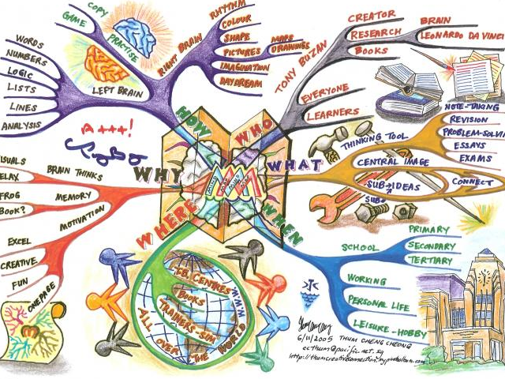
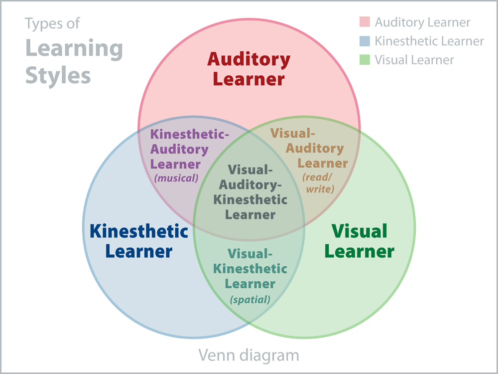
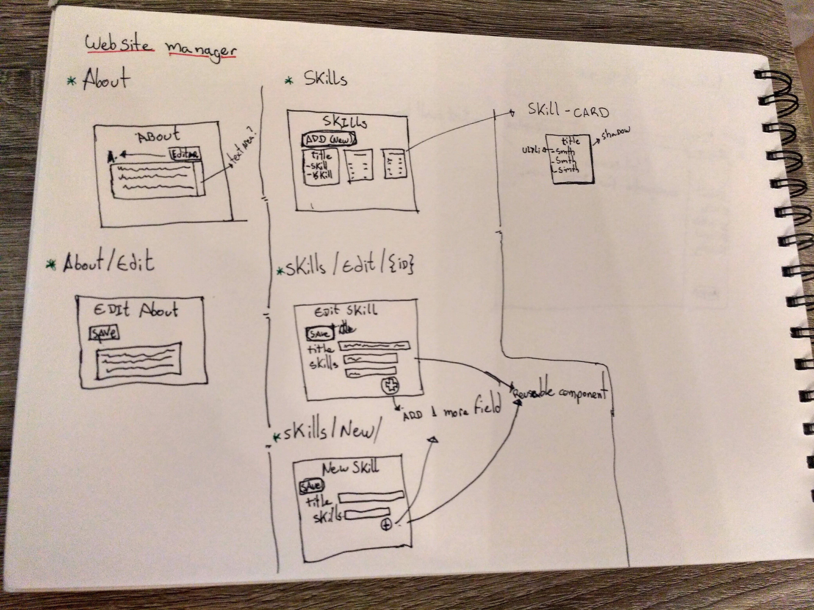
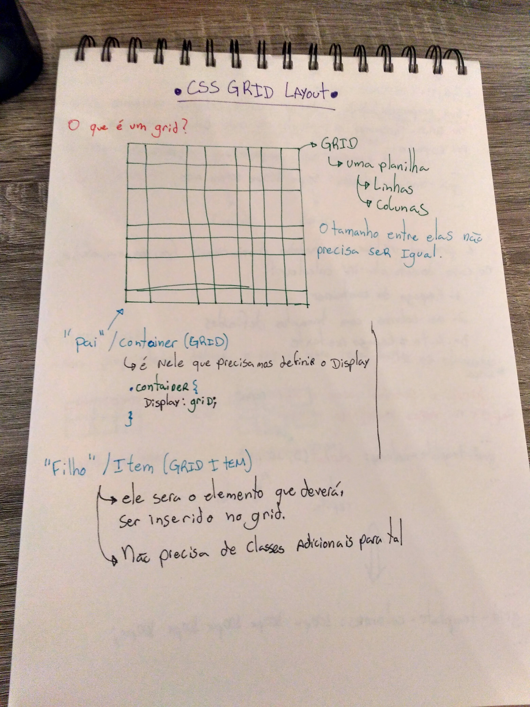

Uma dúvida que muita gente tem, principalmente quem está iniciando na área é: Tem um mar de coisas, por onde caralhos eu começo?

Caso você esteja passando exatamente por isso, relaxa. É mais que normal e todo mundo já passou e as vezes passa até hoje.

Mas afinal, qual a solução?

Se você leu o Ato 4 (Vida universitária e Sistemas de Informação), você viu que um dos pontos positivos de se fazer uma faculdade é exatamente esse, ter contato com diversas matérias diferentes.

Lá eu pude ter contato com diferentes linguagens, diferentes áreas (front, back e infra) e pude ver o que mais me atraia.

Mas, talvez não se matricular em uma faculdade só pra ter esse tipo de _insight_ não seja a melhor maneira de testar o que você realmente quer trabalhar.

Pensando nisso, fiz uma lista de tópicos e dicas que eu daria pra alguém que está começando.

---

## Autoconhecimento

Pois é jovem, antes de mais nada, se você quiser seguir em frente nos seus estudos, independente de qual área seja, é preciso se conhecer.

Já fiz uma crítica sobre o modelo tradicional de ensino por aqui, mas vou voltar a falar sobre isso, e você vai logo entender o motivo.

Na escola, somos treinados para passar em provas. Fazemos provas desde que nos entendemos por gente até terminar a faculdade.

E ao contrário do que se espera, a maioria dos estudantes estuda para passar na prova, pra tirar nota, pra se formar.

E devido a esse pequeno fato, as vezes pegamos uma forma de estudo que deu certo uma vez e seguimos com ela, sem se quer se preocupar com a qualidade do que estamos fazendo.

Ainda pra piorar, como em toda profissão, do ensino fundamental até a faculdade, temos professores péssimos, que não se importam em tentarem atingir todos os tipos de estudantes da sala.

> Tipos de estudantes? Como assim?

<!-- TODO: FIX THIS SPACE -->
<br/>

### Tipos de Estudantes

Você já parou pra pensar qual é a forma com que você mais aprende? Tenta lembrar de alguma matéria ou tema que você aprendeu em algum momento da sua vida e consegue lembrar até hoje. Tenta lembrar da metodologia que foi utilizada para passar esse conhecimento pra você.

Vou listar abaixo os 3 tipos de pessoas, tenta ver se te ajuda:

#### Visual



O aluno visual é aquele que consegue memorizar e aprender muito mais fácil quando há representações visuais, ou seja, imagens, desenhos, gráficos, coisas coloridas, formas diferentes, mapas mentais. Enfim, qualquer tipo de imagem que consegue prover uma explicação visual do conceito teórico que está sendo passado a ele.

#### Auditivo


O aluno auditivo é aquele que consegue aprender apenas ouvindo. Quando está prestando atenção no que o locutor está dizendo, apenas ouvindo ele cria uma estrutura mental onde tudo aquilo faz sentido pra ele. Geralmente na sala de aula é aquela pessoal que nem abre o caderno, fica só prestando atenção no que o professor está dizendo e ainda assim aprende muito.

#### Cinestésico


O aluno cinestésico é o cara do "mãos na massa". Ele só vai conseguir aprender MESMO se colocar em prática, se ver aquilo funcionando de alguma forma, seja criando algo ou fazendo um exercício onde ele possa aplicar todo aquele conceito.

---

Mas, como você já deveria saber, a vida sempre vai ser muito mais cinza do que preto ou branco. Logo, podemos ter um pouco os traços de duas dessas características, ou das 3, como mostra esse diagrama de Venn sobre os tipos de alunos:



O razão de possuir esse conhecimento é simplesmente a maneira que vai fazer você aprender de fato.

Eu por exemplo, sou uma combinação de **visual** e **cinestésico**, saca só:





E além disso, eu SEMPRE prático o que eu to estudando, porque se eu não o fizer, de nada adiantou ter estudado.

---

## Descobrindo o seu formato de conteúdo

Além de descobrir qual a forma que você aprende, você precisa descobrir qual é o formato de mídia que mais te ensina, algumas delas são:

- Livros
- Artigos técnicos e documentação
- Cursos em vídeo
- Podcast/audio books
- Sala de aula

Eu particularmente não sou fã de livros técnicos. Já tentei alguns, mas acho meio chato. Documentação eu gosto de ler, porque ela tenta te ensinar uma coisa da maneira mais clara e direta ao ponto.

Mas, de todas elas, sem dúvida, meu meio preferido de estudar é assistindo video aula.

Além de vários cursos comprados na Udemy, tenho assinatura no Alura há 3 anos já e pro meu estilo de aprendizado é o que mais se encaixa.

Outra que eu gosto bastante é Podcast. Apesar de não ser visual, eu gosto de ouvir ideias e debate sobre os temas e depois procurar mais sobre. Sempre me traz bons insights do que estudar ou começar a dar uma olhada.

Mais pra frente farei um apanhado das mídias que eu consumo.

**Resumindo…**

Descubra qual é a sua forma de aprendizado e isso ajudará você a ver progressão o quanto antes.

---

## Qual área devo seguir?

> ["O mercado de trabalho em programação" - Blog da Alura](https://www.alura.com.br/artigos/o-mercado-de-trabalho-em-programacao)

Dentro da área de TI existem várias possíveis áreas. Nos atos anteriores eu comentei sobre eu gostar de conhecer um pouco de tudo.

Sim, não gosto de ficar preso a apenas uma coisa. Apesar de ter minha preferência pelo Front, já tive contato com o back-end por exemplo e gosto bastante.

No meu caso, a faculdade me trouxe essas experiências, mas nada vai impedir você de gerar a sua própria experiência. É para isso que existe o Freecode Camp.

## FreeCodeCamp

> [Freecodecamp: Curso Online, gratuíto e com certificado!](https://www.freecodecamp.org/)

O freecodecamp é um comunidade internacional que busca prover conhecimento técnico e profissional para pessoas da área de desenvolvimento.

Eles possuem uma plataforma que segue uma trilha de estudos e exercícios que passa por todas áreas, do básico da lógica e algoritmos, ao básico do front-end, básico de back-end, intermediário e avançado.

Como se trata de uma comunidade internacional e mundial (tem gente de todo canto do globo), tudo é inglês.

Se você ainda não sabe, eu sugiro que comece a estudar em paralelo aos estudos de programação, pois, na área de tecnologia, a linguagem universal é o Inglês!

Além dessa plataforma de treinamento deles, ainda tem os artigos no Medium, que contém conteúdo que vai desde o básico até o avançado.

> [FreeCodeCamp: Blog](https://www.freecodecamp.org/news/)

Mencionei eles por causa de um post que gosto muito, que é o Developer Road Map.

Basicamente, uma galera muito experiente criou um mapa das coisas que nós, desenvolvedores, devemos aprender, ou seja, a trilha!

> [A roadmap to becoming a web developer in 2017](https://www.freecodecamp.org/news/a-roadmap-to-becoming-a-web-developer-in-2017-b6ac3dddd0cf/)

No artigo acima há 3 trilhas: Front-end, Back-end e DevOps. Além de ter uma lista de coisas que todo desenvolvedor precisa saber.

Então assim, tenta manter a seguinte lógica:

- O que eu quero aprender? Esse tal de Python parece legal.
- Procurar vídeo aula de Python no YouTube
- Tentar escrever um programa
- Ver o que você sentiu.

Infelizmente, a gente só descobre o que gosta tentando.

Supondo que você não gostou de Python, tenta Ruby, e vê o que acha da linguagem. Já pensou como são feitos os sites? Tenta ver umas aulas de HTML no YouTube, cria umas páginas próprias.

Enfim, aqui a dica é a mesma de leitura: Escolhe qualquer uma que parecer interessante. Não gostou? Troca! Até encontrar uma que você realmente goste.

Eu passei pelo C, C++, Java, C#, PHP, aí conheci JavaScript e decidi que era ali que queria me especializar. Mas apesar de gostar de JavaScript, eu ainda tenho bastante interesse em aprender Go, Kotlin, Closure e quem sabe futuramente, me aventurar no mundo DevOps, só pra ver qualé.

Por hora, a minha escolha no JavaScript foi excelente, pois, eu consigo desenvolver aplicações Back-end com o NodeJS e front-end usando HTML/CSS/JS puro ou algum framework que usa JavaScript como base (React ❤).

Escolha. Tente. Falhe. Tente de nove. Arrisque. Acerte!

### ⚠️ Atenção ⚠️

Recentemente as meninas do podcast [PodProgramar](https://mundopodcast.com.br/podprogramar/) fizerem um compilado das 10 linguagens para se aprender a programar em 2018. Nele, elas dão dicas de linguagens para programadores mais experientes e pra quem está começando. Sugiro fortemente que tire um momento do seu dia para ouvir!

> [Linguagens para aprender em 2018 - PodProgramar](https://mundopodcast.com.br/podprogramar/linguagens-2018/)

---

## O SEGREDO!

Agora que você já sabe mais ou menos como o que estudar, vou te dar a dica mais valiosa de todas. Vou revelar o segredo de conseguir se tornar um desenvolvedor melhor a cada dia que passa….

PREPARADO?

…

<gif src="https://media.giphy.com/media/3ohs81iL7Sx4mj0QOA/giphy.gif" caption="Mal posso esperar…. o/"></gif>

…

….

……..

**PRÁTICA DELIBERADA!!!!**

<gif src="https://media.giphy.com/media/bQCWmEgKHasZG/giphy.gif" caption="E aí… gostaram?"></gif>

> Nossa Raul… sério? tava esperando

É então… geralmente a gente sempre espera um caminho mais curto, um macete, um truque, mas não jeito comparanheirx, como diria aquele velho ditado clichê: "A prática leva a perfeição".

E, além de levar a perfeição, te traz experiência:

<!-- TODO: Fix this space -->
<br/>

<iframe width="560" height="315" src="https://www.youtube.com/embed/uqp5-F2_-lU" frameborder="0" allow="accelerometer; autoplay; encrypted-media; gyroscope; picture-in-picture" allowfullscreen></iframe>

---

Mas pra melhorar um pouco essa dica, vou te contar como eu aprendi a praticar e a metodologia que eu uso até os dias de hoje.

Eu sempre gostei de automatizar TUDO, sério, TUDO. Se eu faço uma coisa duas vezes seguida, já fico pensando como eu posso ter menos trabalho fazendo isso.

Isso implica que qualquer problema que eu tenha, eu queira fazer alguma coisa pra melhorar.

> Ta, me dá um exemplo aí então…

Então segura…

Ano passado eu comecei a assistir Mr. Robot (assista, sério, vale a pena). TODO episódio que eu baixava, eu tinha que ir atrás da legenda.

A cada novo episódio baixado, eu entrava no site do TV-Subs e ia lá procurar minhas legendas. Até que eu falei:

> PERAI! Eu sou um fodendo desenvolvedor… eu consigo bolar um script para procurar essas legendas pra mim!!!11

Comecei a procurar então sobre duas coisas:

1. Como fazer web scraping usando Node, já que minha main language é JavaScript;
1. Como fazer um programa de linha de comando (CLI);

Olhei a estrutura do site em questão, descobri quais os serviços que ele consulta (segurança pra que rs) e vualá:

> [Sub-tv repositório](https://github.com/sub-tv/sub-tv-cli)

Eis que nasce o meu filho!

Esses dias eu recebi uma issue falando que ele tinha parado de funcionar. Peguei pra olhar o código que eu mesmo escrevi há meses atrás e pensei:

> Não é possível que eu escrevi isso… eu sou muito burro…

No fim, descobri que o site havia mudado a URL do serviço. Fiz as alterações e ela voltou a funcionar.

Mas a questão é, olhar meu código de alguns meses atrás me fez ver o quão importante é programar todos os dias (ou quase todos os dias), sempre fazendo coisas, refatorando seu código, melhorando a si mesmo.

> Ahhh Raul… mas eu não sei muita coisa, pra esse projeto você usou vários conceitos…

Beleza… vou te dar outro exemplo, e esse é tão simples que eu até esqueci de publicar no meu Github.

Na empresa onde eu trabalho eu tenho horário bem flexível. Então eu posso chegar "a hora que eu quiser". As vezes chego 8 e pouco, as vezes 9 e pouco, as vezes 10. O que manda é que eu tenho cumprir 8 horas de trabalho no dia. Fora isso, eu tenho meu almoço que pode ser de 0 a 30 minutos na média.

Então toda vez eu tinha que fazer uma continha:

```
Horário de entrada: X
Almoço: Y
Carga horária: 8X + (8 + Y) = Horário que eu tenho que sair
```

Matemática básica (com tempos, né).

Já cansei de usar o [MomentJS](https://momentjs.com/) pra trabalhar com hora, então pensei: Por que eu não escrevo um pacote node só pra falar a hora que eu entrei, fazer uns cálculos e pegar a hora que eu tenho que sair?

> [Work Time CLI helper](https://github.com/raulfdm/work-time-helper)

E apesar de não ter README, não estar no Github, eu pratiquei, eu resolvi um problema que eu tinha:

<gif src="https://media.giphy.com/media/U15qBXEmO8SHbSmZY5/giphy.gif" caption="Pacotinho tranquilo…"></gif>

Então, se eu pudesse te dar um conselho, um só, eu diria, pratique… pratique muito… resolva todos os seus problemas (possíveis de serem resolvidos, claro) com programação.

Não interessa se seu código é feio, ou se ele poderia ser melhor, apenas faça!

---

## Github, ó, meu querido Github


Ainda na onda de **prática deliberada**, você PRECISA mostrar pro mundo suas coisas.

Eu sei, da vergonha as vezes… você sabe que fez o seu melhor e que parece que não é o bastante, mas é preciso o mínimo de exposição.

A proposta do Github, além de ser uma plataforma de versionamento de código, é ser uma rede social. Você consegue seguir pessoas, ver o que elas estão codando, ver como elas organizam seus projetos, como funciona um projeto grande, pois hoje, projetos gigantescos como o React, BabelJS, Visual Studio Code, Vue, DotNet, TypeScript, Go Lang, dentre muitos outros estão com o código seu aberto, pra você se sentir a vontade de olhar, baixar, ver como funciona.

Mostre seu código pro mundo. Ele pode ser ser útil, nem que seja pra alguém ver como é sua lógica, como é sua escrita de código, sua organização.

Como ele é público, procure não fazer de qualquer jeito. Coloque apresentações legais, tente documentar o máximo seus projetos, dê nomes legais pros projetos, tenha consistência. Pode ser que alguém procure seu nome no google e caia justamente no seu perfil do Github.

Ainda não se convenceu da importância disso? Vou te contar uma história (adiantando dos Atos futuros).

Meu primeiro emprego de Freela veio depois de vários projetos expostos nas comunidades do Facebook e depois de 2 anos, onde eu só fiquei codando por diversão.

Quando eu fiz a entrevista pra trabalhar na Holanda, a primeira coisa que o Recrutador fez na minha frente foi abrir meu Github e olhar os meus projetos pinados.

Ele me fez uma série de perguntas sobre alguns, me pediu pra explicar como implementei outros, já aproveitou pra fazer questões sobre codificar em JavaScript usando ES6+ e dar compatibilidade com browsers antigos.

Enfim, mais importante que meu site, sem dúvida nenhuma foi tudo o que eu tinha feito de código e deixado aberto pra quem quiser ver!

Não caia na besteira de esconder suas criações, a menos que seja comercial e tenha contratos e etc.! Você não vai se arrepender! =)

---

## Comunidade

Outro ponto que me ajudou muito a evoluir foi interagir com vocês (a comunidade).

Em 2016 eu conheci por um acaso um dos programas do [Training Center (CT)](https://medium.com/trainingcenter) mais maravilhosos de todos, o [MENTORIA](https://github.com/training-center/mentoria).

Infelizmente ele está congelado por hora, mas basicamente é um programa da comunidade de desenvolvimento que tentava unir pessoas com mais conhecido para ser mentoras de pessoas que estavam começando agora ou que queriam aprender coisas específicas.

Conheci pessoas maravilhosas (Valeu [Wésley Queiroz](https://twitter.com/wesleycoder)) que puderam me ajudar, esclarecer dúvidas, enfim, dar pelo menos uma direção no caminho.

Além do mais, o CT possui um canal do Slack muito movimentado, que o pessoal vive compartilhando artigos, trocando ideias de soluções para problemas, e isso pelo simples prazer de ajudar.

Faça parte de comunidades, é extremamente importante. Você consegue sim ser um desenvolvedor lobo solitário, mas a gente sabe que às vezes o caminho é muito mais fácil de ser trilhado quando temos ajuda de pessoas que estão dispostas ajudar.

Mas quero deixar claro, participe de maneira saudável. Não seja mais um cara tóxico no meio dos que já tem. Uma boa comunidade é uma comunidade unida, onde as pessoas se ajudam e não humilham as outras.

Eu entendo que às vezes alguém faz uma pergunta que com uma Googlada ela poderia ter a resposta, mas vamos pensar comigo: O que você vai ganhar indo lá e ridicularizar ela? Satisfação? Sério que você se satisfaz com isso? Se você não tem nada a acrescentar, finja que nem viu e vai pro próximo post da timeline! =D

> ["Não seja um(a) babaca na comunidade" - Willian Oliveira](https://woliveiras.com.br/posts/n%C3%A3o-seja-um-a-babaca-de-comunidade/)

---

## Dicas de Conteúdo

Por fim, quero deixar aqui uma lista de conteúdo que eu vim descobrindo todos esses anos e que acho sensacionais. Alguns são pagos, outros são grátis, mas em todos, eu tirei e tiro boas experiências.

Mas antes de entrar na lista dos conteúdos, queria fazer uma recomendação master:

### Alura

Se tem uma plataforma que eu utilizei e utilizo há quase 3 anos e não me arrependo de ter assinado, foi a Alura.

Caso você seja uma pessoa que aprende com vídeo aulas, recomendo DEMAIS por algumas razões:

- **Padrão de qualidade**: Como todos os professores são funcionários da Caelum, existe um padrão de curso a ser seguido. Apesar de nem todos os professores serem sensacionais, é notável ver que eles seguem um “Styleguide”;
- **Carreiras**: O Alura já disponibiliza um plano de carreiras, como por exemplo Carreira UX, Front-end, Back-end Java, DevOps, DevMobile, etc.
- **Custo Benefício**: O preço apesar de parecer salgado para alguns orçamos, é bem razoável. Por 75 pilas por mês você tem acesso a 400 cursos e toda semana eles lançam mais dois ou três novos.

  A não ser que você REALMENTE não tenha esse dinheiro pra investir, pense que isso é investimento na sua carreira. Se tu ganha 1000 hoje, se qualificando mais, poderá ganhar 3, 4, 5 vezes mais.
  DICA: Ainda tem o cupom de desconto do NerdCast que você pode [acessar aqui](https://www.alura.com.br/promocao/nerd) e ganhar 10% de desconto no curso! =p

Feita as devidas considerações, vamos a lista:

### Livros

Bom, comentei que não era o cara dos livros, então não tenho muitos pra indicar:

- [Atomic Design](https://bradfrost.com/blog/post/atomic-web-design/) (**Pago**) — Brand Frost (inglês)
- [You Don't know JavaScript](https://github.com/getify/You-Dont-Know-JS) (**Grátis** pra ler online, pago pra impresso e ebook) — Kyle Simpson (Inglês) — [Versão em PT](https://github.com/cezaraugusto/You-Dont-Know-JS)
- [Clean Code](https://www.amazon.co.uk/Clean-Code-Handbook-Software-Craftsmanship/dp/0132350882) (**pago**) — Robert C. Martin
- [Cangaceiro JavaScript](https://www.casadocodigo.com.br/products/livro-cangaceiro-javascript) (**pago**) — Flávio Almeida
- [CSS3](https://novatec.com.br/livros/css3/) (**pago**) — Maurício Samy Silva (Maujor)

Lugares para procurar livros técnicos em Português:

- [Casa Do Código](https://www.casadocodigo.com.br/)
- [NovaTec](https://novatec.com.br/)

---

### Cursos

- [Curso Completo de JavaScript Moderno — ES6](https://www.udemy.com/course/draft/1266556/learn/lecture/7363472#overview) (Pago) — Willian Justen
- [JS com TDD na Prática](https://www.udemy.com/js-com-tdd-na-pratica/learn/v4/overview) (Pago) — Willian Justen
- [Aprendendo SVG Do Início ao Avançado (Pago)](https://www.udemy.com/aprendendo-svg-do-inicio-ao-avancado/learn/v4/overview) — Willian Justen
- [Git e Github na Vida Real (Pago)](https://www.udemy.com/git-e-github-na-vida-real/learn/v4/overview) — Willian Justen
- [Git e Github para iniciantes (Grátis)](https://www.udemy.com/git-e-github-para-iniciantes/) — Willian Justen
- [Criando sites estáticos com Jekyll (Grátis)](https://www.udemy.com/criando-sites-estaticos-com-jekyll/) — Willian Justen
- [Curso React.js Ninja — React Completo (Pago)](https://www.udemy.com/curso-reactjs-ninja/learn/v4/overview) — Fernando Daciuk
- [Curso Completo do Desenvolvedor Web (Pago)](https://www.udemy.com/curso-html5-css3-javascript/learn/v4/overview) — Hcode
- [Angular 4 (e Angular 2) (Grátis)](https://www.youtube.com/watch?v=tPOMG0D57S0&list=PLGxZ4Rq3BOBoSRcKWEdQACbUCNWLczg2G) — Loiane Groner
- [Curso de Python 3 (Grátis)](https://www.youtube.com/watch?v=S9uPNppGsGo&list=PLHz_AreHm4dlKP6QQCekuIPky1CiwmdI6) — Curso em Video (Gustavo Guanabara)
- [Curso de HTML5 completo (Grátis)](https://www.youtube.com/watch?v=epDCjksKMok&list=PLHz_AreHm4dlAnJ_jJtV29RFxnPHDuk9o) — Curso em Video (Gustavo Guanabara)
- [Curso de PHP para Iniciantes (Grátis)](https://www.youtube.com/watch?v=F7KzJ7e6EAc&list=PLHz_AreHm4dm4beCCCmW4xwpmLf6EHY9k) — Curso em Video (Gustavo Guanabara)
- [CSS Grid Layout (Grátis)](https://cssgrid.io/) — Wesbos (inglês)
- [JavaScript30 (Grátis)](https://javascript30.com/) — Wesbos (inglês)
- [What The Flexbox?! (Grátis)](https://flexbox.io/) — Wesbos (inglês)
- [COMMAND LINE POWER USER (Grátis)](http://commandlinepoweruser.com/) — Wesbos (inglês)
- [Learn Redux (Grátis)](https://learnredux.com/) — Wesbos (inglês)
- [Mastering Markdown (Grátis)](https://masteringmarkdown.com/) — Wesbos (inglês)
- [Complete JavaScript course (Grátis)](https://medium.freecodecamp.org/my-giant-javascript-basics-course-is-now-live-on-youtube-and-its-100-free-9020a21bbc27) — Beau Carnes (inglês)
- [370 Cursos online de Programação (Grátis)](https://medium.freecodecamp.org/370-free-online-programming-computer-science-courses-you-can-start-this-month-fc5b9867769e) — Vários (inglês)

---

### Canais no YouTube

> Obs.: Alguns canais estão abandonados, mas os videos continuam recentes e de graça. Vale dar uma conferida pra ver se ter algo do seu interesse.

- [Freecode Camp](https://www.youtube.com/channel/UC8butISFwT-Wl7EV0hUK0BQ)
- [BrazilJS](https://www.youtube.com/channel/UCnLdHOuue5i1O7TsH6oh07w)
- [The Code Train (inglês)](https://www.youtube.com/channel/UCvjgXvBlbQiydffZU7m1_aw)
- [Fun Fun Function (inglês)](https://www.youtube.com/channel/UCO1cgjhGzsSYb1rsB4bFe4Q)
- [Cod3r Cursos Online](https://www.youtube.com/channel/UCqromb78N3C06M_PFUh6rZw)
- [Código Fonte TV (CDF)](https://www.youtube.com/channel/UCFuIUoyHB12qpYa8Jpxoxow)
- [Pagar.me](https://www.youtube.com/channel/UCNhSCufrcOMeFvzEM7tt9Lw)
- [Canal da Loiane Groner](https://www.youtube.com/channel/UCqQn92noBhY9VKQy4xCHPsg)
- [LearCode.Academy (inglês)](https://www.youtube.com/channel/UCVTlvUkGslCV_h-nSAId8Sw)
- [CSS Castshow](https://www.youtube.com/channel/UC9d_htYmYYFUXB2vBKx4NgA)
- [RBTech](https://www.youtube.com/channel/UCVEa_x1n5FwWrxH00MrDPzQ)
- [Webschool](http://uckdo1raf8gzfhvkodzv_ojg/)
- [Canal do Filipe Deschamps](https://www.youtube.com/channel/UCU5JicSrEM5A63jkJ2QvGYw)
- [Node Studio Treinamentos](https://www.youtube.com/channel/UCZZ0NTtOgsLIT4Skr6GUpAw)
- [Curso em Video](https://www.youtube.com/user/cursosemvideo)
- [NodeBR](https://www.youtube.com/channel/UCd4Cp-rzdSAze6C-FOFQ3aw)
- [Hostnet Internet](https://www.youtube.com/channel/UCFYGZ4TumSM844QvhrkYPoQ)
- [Canal do Rodrigo Branas](https://www.youtube.com/channel/UCkqOofjb7nl6V8vXrIbGtiQ)
- [Canal do Estevan Maito](https://www.youtube.com/channel/UCIUOmAsotrzdK8VsZuHfVHw)
- [Canal do André Baltieri](https://www.youtube.com/channel/UCeQiImT1krk6lUiQmJp3m6Q)
- [Balta.io](https://www.youtube.com/channel/UCgnACLvM9O5lfm9ZBh_d3cg)
- [Academind (inglês)](https://www.youtube.com/channel/UCSJbGtTlrDami-tDGPUV9-w)

### Podcasts

- [PodProgramar](https://mundopodcast.com.br/podprogramar/)
- [Hipsters ponto Tech](https://hipsters.tech/)
- [Lambda3](https://www.lambda3.com.br/tag/podcast/)
- [Syntax (inglês)](https://syntax.fm/)
- [DevNaEstrada](https://devnaestrada.com.br/)
- [Freecode Camp Podcast (inglês)](https://medium.freecodecamp.org/the-first-6-episodes-of-the-new-freecodecamp-podcast-ready-for-you-to-binge-on-e9391055edc0)
- [Elemencast](https://elemencast.github.io/#/episodios/3)

### Sites/Feeds

- [Medium: Training Center](https://medium.com/trainingcenter/)
- [Medium: FreecodeCamp (inglês)](https://medium.freecodecamp.org/)
- [Hackernoon (inglês)](https://hackernoon.com/)
- [BrazilJS](https://braziljs.org/)
- [Best Of JavaScript (inglês)](https://bestof.js.org/tags/react)
- [iMasters](https://imasters.com.br/)
- [Blog da Alura](http://blog.alura.com.br/)
- [DailyJS (inglês)](https://medium.com/dailyjs)

### Twitter

O Twitter sem dúvidas pra mim é melhor rede social dos tempos modernos. A melhor porque você consegue personalizar exatamente o que você quer ver na sua timeline. Como meu facebook já virou uma grande bagunça, decidi que usaria o Twitter para seguir as pessoas de tecnologia e pegar pequenas dicas diariamente.

Obviamente eu sigo pessoas que não tem relação nenhuma com a área (tipo o Cid do Não Salvo), mas se rolar minha timeline, vai ver que a maioria são tweets de pessoas técnicas, compartilhando coisas do meu interesse.

Nessa sessão, não citarei pessoas, apenas algumas páginas. Caso você queira saber quem seguir, sugiro olhar os autores dos textos que você lê, procurar pessoas da comunidade, ir vendo as recomendações e seguir quem você admira.

Algumas páginas sensacionais:

- [Training Center](https://twitter.com/trainingcentr)
- [NodeBR](https://twitter.com/nodebr)
- [BrasilJS](https://twitter.com/braziljs)
- [ReactJS News (inglês)](https://twitter.com/ReactJSNews)
- [The Pratical Dev (inglês)](https://twitter.com/ThePracticalDev)
- [JavaScript Daily (inglês)](https://twitter.com/JavaScriptDaily)
- [ProductHunt (Inglês)](https://twitter.com/ProductHunt)

---

## Conclusão

Para concluir, gostaria de deixar só um último recado.

Apesar de polêmico e enquanto vivo, ter tido atitudes bem questionáveis, o senhor Steve Jobs disse uma frase que é bem conhecida e que cabe muito bem aqui:

<big-quote>"Stay hungry. Stay foolish." — Jobs, Steve</big-quote>

Que na tradução literal é algo como:

> Continue faminto. Continue tolo..

Essa frase foi dita em uma de suas palestras em Stanford. Apesar de parecer estranha, é possível interpretar da seguinte forma:

> Continue sempre faminto no quesito conhecimento. Nunca pare de buscar, de ir atrás, não se sinta satisfeito e pare a sua busca por ser melhor a cada dia. Mas ao mesmo tempo, se mantenha consciente da sua ignorância. Não se sinta o melhor de todos e nem acredite que você sabe tudo, porque isso simplesmente limita a possibilidade de estar aberto para novos conhecimentos.

<gif src="https://media.giphy.com/media/GcSqyYa2aF8dy/giphy.gif" caption="DO IT!"></gif>

Fiquem na paz e boa sorte!
