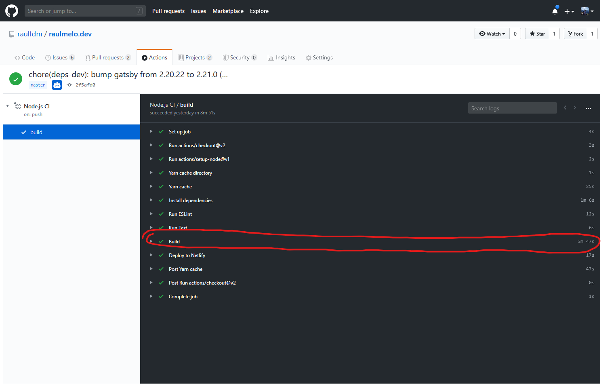
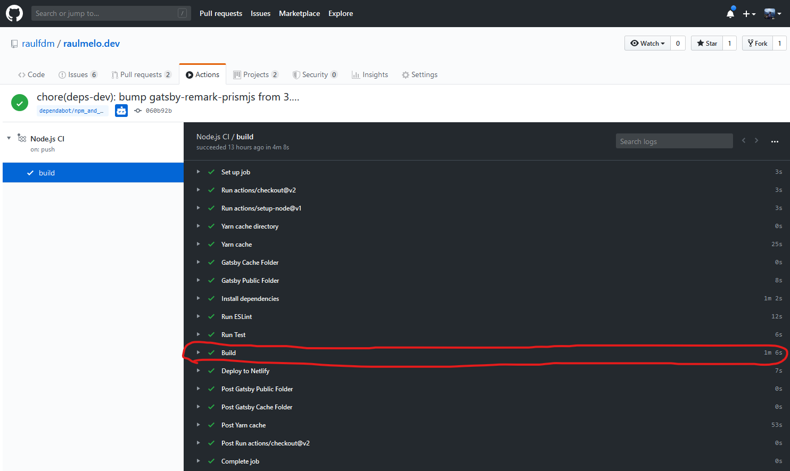

Hey, devs. How is it going during this quarantine? Hope you’re not getting crazy like I'm 😬.

Today I’d like to bring to you a new feature announced on April 22 by Gatsby team: **Incremental builds**.

<blockquote class="twitter-tweet">
   <p lang="en" dir="ltr">📣BIG NEWS: Introducing Incremental Builds!<br><br>➡️<a href="https://t.co/6yYouf0kU4">https://t.co/6yYouf0kU4</a><br><br> ✅Only build the content that&#39;s changed<br> 🚀Real-time builds<br> 😍Marketers and developers are both happy<br><br>Now, harness the powerful benefits of being totally dynamic AND fully static. <a href="https://t.co/WHNw35DlSE">pic.twitter.com/WHNw35DlSE</a></p>
   &mdash; Gatsby (@gatsbyjs) <a href="https://twitter.com/gatsbyjs/status/1252991368005324800?ref_src=twsrc%5Etfw">April 22, 2020</a>
</blockquote>

To follow this guide you will need to know about Gatsby (of course) but also a bit of knowledge of using Github Actions. I won’t dive deep in the details of how to set up a CI environment using it so it’s important to at least have the basics.

---

## Gatsby bottleneck

Gatsby is an amazing toolkit to create static websites using React or maybe set up your JAM (JavaScript, API, and Markup) application. Everything works fine, you can find a bunch of plugins to avoid infrastructure code and the concepts are relatively easy to understand since their documentation is well written and has details about almost everything.

The problem starts as soon as your website starts to have a lot of pages or maybe like my blog, you have a lot of images that need to be processed and compressed to ship a good experience for those who are reading it.

When I start my blog, a build would take approximately less than 2 minutes. After migrating my posts from Medium, in the CI it usually takes from 6 to 8 minutes. As you can imagine, as many posts, images, and data you have I add, as slower my build command becomes.

---

## Incremental Build

Of course, I’m not the only one having this issue. The Gatsby community and adoption are becoming bigger every year given all benefits which it brings for us, developers.

Knowing that they just released a feature called Incremental Build.

The name is self-explanatory I imagine, you’ll only build/generate what have been changed.

Let’s imagine you have a website which has 2 pages, home and about. Then you change something on the “About” page and want to ship it. Does it make sense to build both pages? You only have changed in one. It’s a waste of time and resources.

With this flag, it’ll check all files previously generated and understand what needs to be built.

Another nice benefit of it is if you’re using a CMS which triggers a build for each change you’ve made in a post, page, or any data, you’ll see almost immediately your change live and this is sick!

---

## How it works

If you check their docs, it already has a page under the “improve performance” section which explains what’s the feature and how it works.

In a nutshell, when you run `yarn gatsby build`, it generates 2 folders:

1. `public/`. Here it’s your website. Is the folder you need to host in a web server (e.g. Github Pages, Netlify, etc.)
1. `.cache/`. Here it’s all files cached to speed up the building process.

My first thought was: “Ok, I only need to persist cache and everything will work” but reading till the end they made clear: Both pages need to be persisted.

> Note that until this date I’m writing this post, this feature does not work for `gatsby develop`

---

## My problem

Well, I already explained a bit about my problem: I have tons of images to be processed and a bunch of posts already.

Even when I’m working by myself, I like to create feature branches for my projects just because I can easily revert code or decisions I made by just pressing a button on Github.

So, imagine the situation. I create a feature branch, do my changes and apart from the pipeline saying to me: “Hey, lint, tests, and build are working fine, ship it”, I like to see a live preview that Netlify offers to me.

The first time takes 8 minutes.

Then when I see it online, I notice that I forgot to see something. I fix it and push. Another 8 minutes.

Another case I have is when dependabot creates a PR for me from a major version or maybe I’m using a beta version from some dependency like I’m doing right now with framer-motion.

The pipeline will say it’s green but I still want to check the live preview and be sure that the change won’t affect the experience I want for my website.

When the Gatsby team announced, they (for obvious reasons) did an ad for their cloud platform, Gatsby Cloud.

I have to confess that I was planning on moving there until I realized that when you connect Gatsby Cloud with Github, it has a bug (it might be already fixed) that does not update the stats of “build” to “done”.

After that, I just had one option, making it work for Github Actions.

First I tried to Google to see if people already had solved this problem but I couldn’t find anything. Maybe because it’s new, maybe because google search didn’t rank well yet.

Even not being a CI expert, I have figured out a bunch of stuff by myself reading official docs and inspecting how people set up in open-source projects (pro tip), then I just decided to try by myself.

---

## Setting it up

To enable this feature, be sure you have installed gatsby version 2.20.4 or higher.

After that, you need to specify an environment variable named **GATSBY_EXPERIMENTAL_PAGE_BUILD_ON_DATA_CHANGES** to true in your build context, like:

```shell
GATSBY_EXPERIMENTAL_PAGE_BUILD_ON_DATA_CHANGES=true yarn gatsby build
```

If you want to see what pages have been changed, you can pass the flag `--log-pages` at the end of the command.

In your Github Actions config, you can just add this variable inside “env” context in the build step:

```yml
# CI setup, Install dependencies, lint and tests...
      - run: yarn build --log-pages
        name: Build
        env:
          GATSBY_EXPERIMENTAL_PAGE_BUILD_ON_DATA_CHANGES: true
          NODE_ENV: production
            CI: true
```

> Note that my `build` script is a simpler version of `gatsby build`.

Awesome. The flag will be available when run build.

Now, we need to, somehow, create a CI cache for both `public` and `.cache`.

To do that I’ll use a pre-built action called, guess what, “cache”.

In their docs they give a bunch of explanations how to use, not that complicated, here is the code:

```yml
# CI Setup
- name: Gatsby Cache Folder
  uses: actions/cache@v1
  id: gatsby-cache-folder
  with:
    path: .cache
    key: ${{ runner.os }}-cache-gatsby
    restore-keys: |
      ${{ runner.os }}-cache-gatsby

- name: Gatsby Public Folder
  uses: actions/cache@v1
  id: gatsby-public-folder
  with:
    path: public/
    key: ${{ runner.os }}-public-gatsby
    restore-keys: |
      ${{ runner.os }}-public-gatsby

# Install dependencies, lint, test and build...
```

Both steps are the same, it changes what’s going to be cached.

The important pieces of this code are:

- path: which folder you want to cache;
- key: the name of your cache. In this case, I just copied from my yarn cache. In the end, it will be `Linux-cache-gatsby` and `Linux-public-gatsby` but it can be whatever you want to define.

Restore keys are not that important for this case (maybe for now) but in a nutshell, it defines a list of cache priorities to pick. Imagine you have more caches like `Linux-cache-gatsby-4983b10b` (with a hash), you can say something like:

```yml
restore-keys: |
  ${{ runner.os }}-public-gatsby-4983b10b
  ${{ runner.os }}-public-gatsby
```

If the first isn’t available, it’ll pick the second or it’ll define that it has no cache.

And that’s it. This is all you need to make it work.

Here's my final file:

```yml:title=ci.yml
name: Node.js CI

on: [push]

jobs:
  build:
    runs-on: ubuntu-latest

    steps:
      - uses: actions/checkout@v2
      - uses: actions/setup-node@v1
        with:
          node-version: 12

      - name: Yarn cache directory
        id: yarn-cache-dir
        run: echo "::set-output name=dir::$(yarn cache dir)"

      - name: Yarn cache
        uses: actions/cache@v1
        id: yarn-cache
        with:
          path: ${{ steps.yarn-cache-dir.outputs.dir }}
          key: ${{ runner.os }}-yarn-${{ hashFiles('**/yarn.lock') }}
          restore-keys: |
            ${{ runner.os }}-yarn-

      # In order to make gatsby incremental build works, it's necessary .cache
      # and public folder.
      - name: Gatsby Cache Folder
        uses: actions/cache@v1
        id: gatsby-cache-folder
        with:
          path: .cache
          key: ${{ runner.os }}-cache-gatsby
          restore-keys: |
            ${{ runner.os }}-cache-gatsby

      - name: Gatsby Public Folder
        uses: actions/cache@v1
        id: gatsby-public-folder
        with:
          path: public/
          key: ${{ runner.os }}-public-gatsby
          restore-keys: |
            ${{ runner.os }}-public-gatsby

      - run: yarn install --pure-lockfile
        name: Install dependencies

      - run: yarn lint
        name: Run ESLint

      - run: yarn jest --color
        name: Run Test
        env:
          CI: true

      - run: yarn build --log-pages
        name: Build
        env:
          # incremental builds
          # https://www.gatsbyjs.org/docs/page-build-optimizations-for-incremental-data-changes/
          GATSBY_EXPERIMENTAL_PAGE_BUILD_ON_DATA_CHANGES: true
          NODE_ENV: production
          ENVIRONMENT: ${{ contains(github.ref, 'master') && 'production' || 'staging'}}
          GATSBY_ALGOLIA_APP_ID: ${{ secrets.GATSBY_ALGOLIA_APP_ID }}
          GATSBY_ALGOLIA_SEARCH_KEY: ${{ secrets.GATSBY_ALGOLIA_SEARCH_KEY }}
          ALGOLIA_ADMIN_KEY: ${{ secrets.ALGOLIA_ADMIN_KEY }}
          GATSBY_ALGOLIA_INDEX_NAME: ${{ secrets.GATSBY_ALGOLIA_INDEX_NAME }}

      - name: Deploy to Netlify
        uses: nwtgck/actions-netlify@v1.0
        with:
          publish-dir: './public'
          production-branch: master
          deploy-message: 'Deploy from GitHub Actions'
        env:
          NETLIFY_AUTH_TOKEN: ${{ secrets.NETLIFY_AUTH_TOKEN }}
          NETLIFY_SITE_ID: ${{ secrets.NETLIFY_SITE_ID }}
```

---

## Results

Before I show you the benefits I had on my CI, I want to show you how awesome it’s even locally.

When I remove both `.cache` and `public` folder:

```txt
Done building in 159.0597712 sec
```

Then if I run with the flag and ask to log, it’ll be:

```txt
info Built pages:
Updated page: /offline-plugin-app-shell-fallback/
Updated page: /2020/03/dev-js-9
Updated page: /en/2020/03/yml-for-fe
Updated page: /
Updated page: /2019/04/things-i-dont-know-2018
Updated page: /2020/03/13/corona-virus-overview
Updated page: /2019/03/netlifiy-deploy
Updated page: /2018/09/dev-js-8
Updated page: /2018/07/it-and-english
Updated page: /2018/05/dev-js-7-2
Updated page: /2018/04/dev-js-7-1
Updated page: /2018/02/dev-js-5-1
Updated page: /2018/02/dev-js-5-2
Updated page: /2018/01/css-position
Updated page: /2018/02/dev-js-6
Updated page: /2018/01/dev-js-4
Updated page: /2018/01/dev-js-3-2
Updated page: /2017/12/dev-js-part-3
Updated page: /2017/12/dev-js-part-2
Updated page: /2017/12/dev-js-part-1
Updated page: /2017/09/deploy-fe-with-surge
Updated page: /2017/08/deploy-fe-with-gh-pages
Updated page: /2017/07/franz
Updated page: /2017/07/regex-part-7
Updated page: /2017/06/regex-part-6
Updated page: /2017/06/regex-part-5
Updated page: /2017/06/regex-part-4
Updated page: /2017/05/regex-part-3
Updated page: /2017/05/regex-part-2
Updated page: /2017/05/regex-part-1
Updated page: /2017
Updated page: /2018
Updated page: /2019
Updated page: /2020
Updated page: /2020/03
Updated page: /2019/03
Updated page: /2019/01
Updated page: /2018/09
Updated page: /2018/07
Updated page: /2018/05
Updated page: /2018/04
Updated page: /2018/02
Updated page: /2018/01
Updated page: /2017/12
Updated page: /2017/09
Updated page: /2017/08
Updated page: /2017/07
Updated page: /2017/06
Updated page: /2017/05
Updated page: /404/
Updated page: /search/
Updated page: /uses/
Updated page: /404.html
Done in 23.01s.
```

That’s nice but, what about the CI? Did it have some improvements?

The following image if from a PR opened by dependabot before I implement cache strategy + incremental builds:



The next one is after implementing the strategy:



---

## Conclusion

I’m still figuring out if there are some better strategies to do all this caching thingy, but I already can say that I’m pretty happy with the final results.

I assume is that this feature is only at the beginning. Have you noticed that the flag has named with "EXPERIMENTAL"? As soon they get more and more builds and examples in different repos they will enhance this more and more.

Anyways, I hope I could help you a bit in case you’re also having issues with that. You can find below all links from all resources I used and also the link to my project!

---

## Resources

- [This blog repo](https://github.com/raulfdm/raulmelo.dev)
- [Oficial feature announcement](https://www.gatsbyjs.org/blog/2020-04-22-announcing-incremental-builds/)
- [Gatsby Incremental build documentation](https://www.gatsbyjs.org/docs/page-build-optimizations-for-incremental-data-changes/)
- [JAM stack](https://jamstack.org/)
- [Actions/cache](https://github.com/marketplace/actions/cache)
